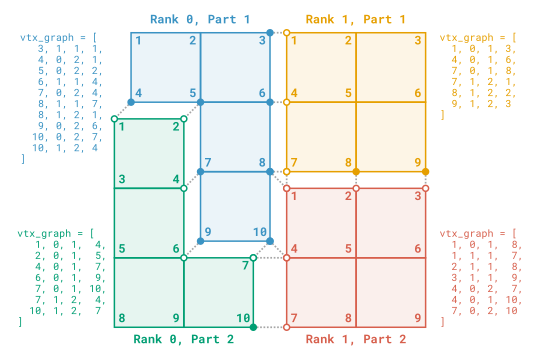

.. _part_comm_graph:

Part Comm Graph
===============

**Part Comm Graph** is a service for managing inter-partition communications between arbitrary entities.

This service does not rely on global IDs, and instead uses addresses based on local indexing.

Concepts
""""""""

.. _pcg_comm_graph_desc:

Communication graph
~~~~~~~~~~~~~~~~~~~

The communication graph can be described by a list of *quadruplets*, each composed of

  - the (1-based) local ID of a partition boundary entity,
  - the (0-based) rank of the connected process,
  - the (1-based) connected partition in the connected process,
  - the connected entity's (1-based) local ID in the connected part of the connected process (can be signed to encode relative orientation).

A visual example of such a graph is shown below, where the entities of interest are the vertices of a mesh partitioned over two processes (with MPI ranks 0 and 1), each decomposed into 2 partitions.
Note that **Part Comm Graph** can be used with any type of entity, including (but not limited to) mesh entities.

.. _pcg_example_visu:

Note that entities connected to more than one entities appear multiple times in their local part of the graph (e.g., vertex 8 in rank 0, part 1).
Also, the communication graph *must* be symmetric.

From this description of the communication graph, **Part Comm Graph** builds internal data structures to ease communications between entities connected in the graph.
Multiple modes of communication are available (see the :ref:`Exchange data <pcg_exch>` dropdown in the :ref:`API <pcg_api>` section below).

Owner status
~~~~~~~~~~~~

For each connected component of the graph, a single entity is flagged as *owner* (not to be confused with memory ownership !).
This status is determined automatically at the creation of the **Part Comm Graph** instance, and can be used in algorithms that require inter-partition synchronizations for example.
In the :ref:`example above <pcg_example_visu>`, the owner vertices are represented by solid dots, and the "ghost" vertices by circles.

Integration with other ParaDiGM features
~~~~~~~~~~~~~~~~~~~~~~~~~~~~~~~~~~~~~~~~

The :ref:`Part Mesh Nodal <part_mesh_nodal>` data structure can hold **Part Comm Graph** instances for 0, 1, 2 and 3D mesh elements, as well as for vertices.
A mesh partitioned using :ref:`Multipart <multipart>` and :ref:`retrieved in the form of a Part Mesh Nodal <multipart_outputs>` comes with ready-to-use **Part Comm Graph** instances.

.. same for Part Mesh but not yet documented

.. _pcg_api:

API
"""

.. dropdown:: Initialization

  A **Part Comm Graph** is created by providing the array describing the communication graph, as described :ref:`above <pcg_comm_graph_desc>`.

  Additional information can be provided by means of a n-uplet of integers for each graph entity.

  .. tab-set::
    :sync-group: language

    .. tab-item:: C
      :sync: C

      .. doxygenfunction:: PDM_part_comm_graph_create
      .. doxygenfunction:: PDM_part_comm_graph_with_nuplet_create

    .. tab-item:: Fortran
      :sync: Fortran

      .. ifconfig:: enable_fortran_doc == 'ON'

        .. f:autosubroutine:: PDM_part_comm_graph_create
        .. f:autosubroutine:: PDM_part_comm_graph_with_nuplet_create

      .. ifconfig:: enable_fortran_doc == 'OFF'

        .. warning::
          Unavailable (refer to the :ref:`installation guide <enable_fortran_interface>` to enable the Fortran API)

    .. tab-item:: Python
      :sync: Python

      .. ifconfig:: enable_python_doc == 'ON'

        .. py:class:: PartCommGraph

          .. automethod:: Pypdm.Pypdm.PartCommGraph.__init__

      .. ifconfig:: enable_python_doc == 'OFF'

        .. warning::
          Unavailable (refer to the :ref:`installation guide <enable_python_interface>` to enable the Python API)

.. _pcg_api_getters:

.. dropdown:: Access to internal structure

  Once created, the components of a **Part Comm Graph** can be accessed.

  .. tab-set::
    :sync-group: language

    .. tab-item:: C
      :sync: C

      .. doxygenfunction:: PDM_part_comm_graph_n_entity_get
      .. doxygenfunction:: PDM_part_comm_graph_entity_graph_get
      .. doxygenfunction:: PDM_part_comm_graph_owner_get
      .. doxygenfunction:: PDM_part_comm_graph_nuplet_size
      .. doxygenfunction:: PDM_part_comm_graph_entity_nuplet_get

    .. tab-item:: Fortran
      :sync: Fortran

      .. ifconfig:: enable_fortran_doc == 'ON'

        .. f:autofunction::   PDM_part_comm_graph_n_entity_get
        .. f:autosubroutine:: PDM_part_comm_graph_entity_graph_get
        .. f:autosubroutine:: PDM_part_comm_graph_owner_get
        .. f:autofunction::   PDM_part_comm_graph_nuplet_size
        .. f:autosubroutine:: PDM_part_comm_graph_entity_nuplet_get

      .. ifconfig:: enable_fortran_doc == 'OFF'

        .. warning::
          Unavailable (refer to the :ref:`installation guide <enable_fortran_interface>` to enable the Fortran API)

    .. tab-item:: Python
      :sync: Python

      .. ifconfig:: enable_python_doc == 'ON'

        .. automethod:: Pypdm.Pypdm.PartCommGraph.entity_graph_get
        .. automethod:: Pypdm.Pypdm.PartCommGraph.owner_get

      .. ifconfig:: enable_python_doc == 'OFF'

        .. warning::
          Unavailable (refer to the :ref:`installation guide <enable_python_interface>` to enable the Python API)

.. _pcg_exch:

.. dropdown:: Exchange data

  Data can be exchanged in multiple ways using a **Part Comm Graph** :

  .. dropdown:: Reduction operations

    Basic reduction operations can be performed easily, enabling data synchronization between partitions.

    .. tab-set::
      :sync-group: language

      .. tab-item:: C
        :sync: C

        .. doxygenfunction:: PDM_part_comm_graph_allreduce

      .. tab-item:: Fortran
        :sync: Fortran

        .. ifconfig:: enable_fortran_doc == 'ON'

          .. f:autosubroutine:: PDM_part_comm_graph_allreduce

        .. ifconfig:: enable_fortran_doc == 'OFF'

          .. warning::
            Unavailable (refer to the :ref:`installation guide <enable_fortran_interface>` to enable the Fortran API)

      .. tab-item:: Python
        :sync: Python

        .. ifconfig:: enable_python_doc == 'ON'

          .. automethod:: Pypdm.Pypdm.PartCommGraph.allreduce

        .. ifconfig:: enable_python_doc == 'OFF'

          .. warning::
            Unavailable (refer to the :ref:`installation guide <enable_python_interface>` to enable the Python API)

  .. dropdown:: Blocking communications

    .. tab-set::
      :sync-group: language

      .. tab-item:: C
        :sync: C

        .. doxygenfunction:: PDM_part_comm_graph_exch

      .. tab-item:: Fortran
        :sync: Fortran

        .. ifconfig:: enable_fortran_doc == 'ON'

          .. f:autosubroutine:: PDM_part_comm_graph_exch

        .. ifconfig:: enable_fortran_doc == 'OFF'

          .. warning::
            Unavailable (refer to the :ref:`installation guide <enable_fortran_interface>` to enable the Fortran API)

      .. tab-item:: Python
        :sync: Python

        .. ifconfig:: enable_python_doc == 'ON'

          .. automethod:: Pypdm.Pypdm.PartCommGraph.exch

        .. ifconfig:: enable_python_doc == 'OFF'

          .. warning::
            Unavailable (refer to the :ref:`installation guide <enable_python_interface>` to enable the Python API)

  .. dropdown:: Non-blocking communications

    .. tab-set::
      :sync-group: language

      .. tab-item:: C
        :sync: C

        .. doxygenfunction:: PDM_part_comm_graph_iexch
        .. doxygenfunction:: PDM_part_comm_graph_exch_wait

      .. tab-item:: Fortran
        :sync: Fortran

        .. ifconfig:: enable_fortran_doc == 'ON'

          .. f:autosubroutine:: PDM_part_comm_graph_iexch
          .. f:autosubroutine:: PDM_part_comm_graph_exch_wait

        .. ifconfig:: enable_fortran_doc == 'OFF'

          .. warning::
            Unavailable (refer to the :ref:`installation guide <enable_fortran_interface>` to enable the Fortran API)

  .. dropdown:: Persistent communications

    TODO: Expliquer vite fait ce que sont les persistent communications

    First, a persistent request must be created (only once):

    .. tab-set::
      :sync-group: language

      .. tab-item:: C
        :sync: C

        .. doxygenfunction:: PDM_part_comm_graph_exch_init

      .. tab-item:: Fortran
        :sync: Fortran

        .. ifconfig:: enable_fortran_doc == 'ON'

          .. f:autosubroutine:: PDM_part_comm_graph_exch_init

        .. ifconfig:: enable_fortran_doc == 'OFF'

          .. warning::
            Unavailable (refer to the :ref:`installation guide <enable_fortran_interface>` to enable the Fortran API)

    Then the request can be used multiple times to exchange data using the same send and recv buffers:

    .. tab-set::
      :sync-group: language

      .. tab-item:: C
        :sync: C

        .. doxygenfunction:: PDM_part_comm_graph_exch_start

      .. tab-item:: Fortran
        :sync: Fortran

        .. ifconfig:: enable_fortran_doc == 'ON'

          .. f:autosubroutine:: PDM_part_comm_graph_exch_start

        .. ifconfig:: enable_fortran_doc == 'OFF'

          .. warning::
            Unavailable (refer to the :ref:`installation guide <enable_fortran_interface>` to enable the Fortran API)

    Finally, the persistent request must be freed:

    .. tab-set::
      :sync-group: language

      .. tab-item:: C
        :sync: C

        .. doxygenfunction:: PDM_part_comm_graph_exch_free

      .. tab-item:: Fortran
        :sync: Fortran

        .. ifconfig:: enable_fortran_doc == 'ON'

          .. f:autosubroutine:: PDM_part_comm_graph_exch_free

        .. ifconfig:: enable_fortran_doc == 'OFF'

          .. warning::
            Unavailable (refer to the :ref:`installation guide <enable_fortran_interface>` to enable the Fortran API)

.. dropdown:: Finalization

  .. tab-set::
    :sync-group: language

    .. tab-item:: C
      :sync: C

      .. doxygenfunction:: PDM_part_comm_graph_free

    .. tab-item:: Fortran
      :sync: Fortran

      .. ifconfig:: enable_fortran_doc == 'ON'

        .. f:autosubroutine:: PDM_part_comm_graph_free

      .. ifconfig:: enable_fortran_doc == 'OFF'

        .. warning::
          Unavailable (refer to the :ref:`installation guide <enable_fortran_interface>` to enable the Fortran API)

    .. tab-item:: Python
      :sync: Python

      |python_gc|
