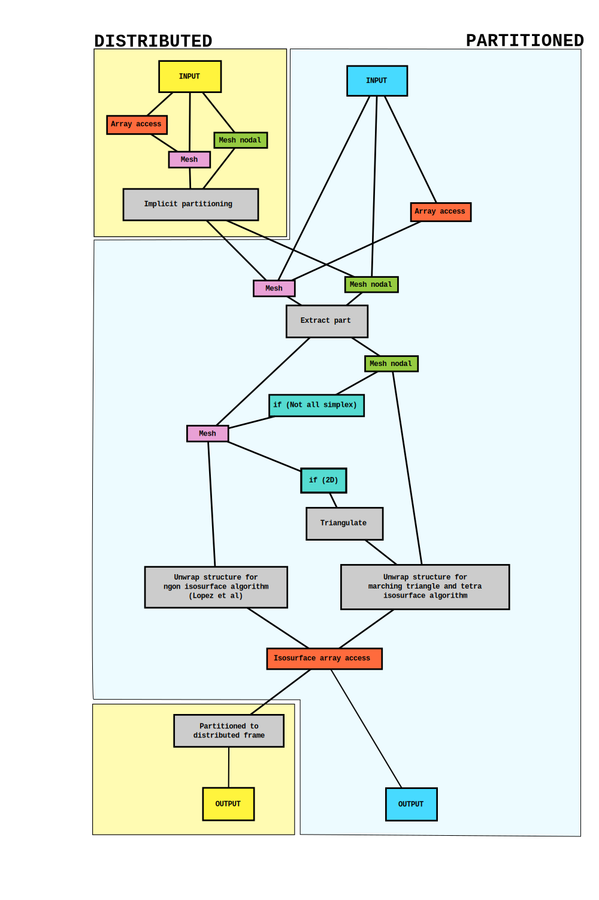

.. _isosurface:

Iso-surfaces
============

**pdm_isosurface** provides a distributed and partitioned API for iso-surface mesh generation
from 2D or 3D meshes.

The input mesh can be defined either as a **D/Part Mesh Nodal** (volume, surface and ridge elements described by element→vertex connectivity) or as **D/Part Mesh** (entities described by descending connectivity: cell→face→(edge→)vertex).
Depending on the input, the core algorithm will not be the same.

If the input is a nodal mesh fully composed of tetrahedra and triangles, an edge-based variation of
`Marching Tetrahedra <https://en.wikipedia.org/wiki/Marching_tetrahedra>`_ algorithm will be used.

For multi-elements nodal meshes and for meshes, the `"NGon" algorithm <https://www.sciencedirect.com/science/article/pii/S0021999121004745>`_
will be used.

In any case, if the input is a 2D mesh, elements
will be triangulated to use an edge-based variation of `Marching Triangles <https://en.wikipedia.org/wiki/Marching_triangles>`_ algorithm.

For more details, please refer to the :ref:`Algorithm description` section.

C API
-----

Initialization
""""""""""""""

.. doxygenfunction:: PDM_isosurface_create

Input mesh definition
"""""""""""""""""""""

Partitioned
~~~~~~~~~~~

.. doxygenfunction:: PDM_isosurface_n_part_set
.. doxygenfunction:: PDM_isosurface_pconnectivity_set
.. doxygenfunction:: PDM_isosurface_pvtx_coord_set
.. doxygenfunction:: PDM_isosurface_ln_to_gn_set
.. doxygenfunction:: PDM_isosurface_pgroup_set

.. doxygenfunction:: PDM_isosurface_part_mesh_set

.. doxygenfunction:: PDM_isosurface_part_mesh_nodal_set

Block-distributed
~~~~~~~~~~~~~~~~~

.. doxygenfunction:: PDM_isosurface_dconnectivity_set
.. doxygenfunction:: PDM_isosurface_dvtx_coord_set
.. doxygenfunction:: PDM_isosurface_distrib_set
.. doxygenfunction:: PDM_isosurface_dgroup_set

.. doxygenfunction:: PDM_isosurface_dmesh_set

.. doxygenfunction:: PDM_isosurface_dmesh_nodal_set

Iso-surface settings
""""""""""""""""""""

.. doxygenfunction:: PDM_isosurface_redistribution_set

.. doxygenfunction:: PDM_isosurface_n_part_out_set

.. doxygenfunction:: PDM_isosurface_add

.. doxygenfunction:: PDM_isosurface_isovalues_set

.. doxygenenum:: PDM_iso_surface_kind_t

.. doxygenfunction:: PDM_isosurface_equation_set
.. doxygenfunction:: PDM_isosurface_field_function_set

.. doxygentypedef:: PDM_isosurface_field_function_t

.. doxygenfunction:: PDM_isosurface_set_tolerance

Partitioned discrete field
~~~~~~~~~~~~~~~~~~~~~~~~~~

.. doxygenfunction:: PDM_isosurface_pfield_set

Block-distributed discrete field
~~~~~~~~~~~~~~~~~~~~~~~~~~~~~~~~

.. doxygenfunction:: PDM_isosurface_dfield_set

Iso-surface computation
"""""""""""""""""""""""

.. doxygenfunction:: PDM_isosurface_reset
.. doxygenfunction:: PDM_isosurface_compute
.. doxygenfunction:: PDM_isosurface_dump_times

Outputs
"""""""

Partitioned
~~~~~~~~~~~

.. doxygenfunction:: PDM_isosurface_pconnectivity_get
.. doxygenfunction:: PDM_isosurface_pvtx_coord_get
.. doxygenfunction:: PDM_isosurface_ln_to_gn_get
.. doxygenfunction:: PDM_isosurface_pgroup_get
.. doxygenfunction:: PDM_isosurface_plocal_parent_get
.. doxygenfunction:: PDM_isosurface_pparent_weight_get
.. doxygenfunction:: PDM_isosurface_pisovalue_entity_idx_get

Block-distributed
~~~~~~~~~~~~~~~~~

.. doxygenfunction:: PDM_isosurface_distrib_get
.. doxygenfunction:: PDM_isosurface_dconnectivity_get
.. doxygenfunction:: PDM_isosurface_dvtx_coord_get
.. doxygenfunction:: PDM_isosurface_dgroup_get
.. doxygenfunction:: PDM_isosurface_dparent_weight_get

Communication graphs
~~~~~~~~~~~~~~~~~~~~

.. doxygenfunction:: PDM_isosurface_part_to_part_enable
.. doxygenfunction:: PDM_isosurface_part_to_part_get

Finalization
""""""""""""

.. doxygenfunction:: PDM_isosurface_free

Fortran API
-----------

.. ifconfig:: enable_fortran_doc == 'ON'

  .. todo:: TO DO

.. ifconfig:: enable_fortran_doc == 'OFF'

  .. warning::
    Unavailable (refer to the :ref:`installation guide <enable_fortran_interface>` to enable the Fortran API)

Python API
----------

.. ifconfig:: enable_python_doc == 'ON'

  .. py:class:: Isosurface

    Python structure to perform isosurface and slice construction. Once initialized, all the following
    methods apply to a :class:`Isosurface` instance.

    .. rubric:: Initialization

    .. autofunction:: Pypdm.Pypdm.Isosurface.__init__

    .. rubric:: Isosurface general inputs

    .. automethod:: Pypdm.Pypdm.Isosurface.tolerance_set
    .. automethod:: Pypdm.Pypdm.Isosurface.add
    .. automethod:: Pypdm.Pypdm.Isosurface.isovalues_set
    .. automethod:: Pypdm.Pypdm.Isosurface.equation_set
    .. automethod:: Pypdm.Pypdm.Isosurface.field_function_set
    .. automethod:: Pypdm.Pypdm.Isosurface.compute
    .. automethod:: Pypdm.Pypdm.Isosurface.reset
    .. automethod:: Pypdm.Pypdm.Isosurface.part_to_part_enable

    .. rubric:: Partitioned source mesh definition

    .. automethod:: Pypdm.Pypdm.Isosurface.mesh_n_part_set
    .. automethod:: Pypdm.Pypdm.Isosurface.n_part_out_set
    .. automethod:: Pypdm.Pypdm.Isosurface.connectivity_set
    .. automethod:: Pypdm.Pypdm.Isosurface.coordinates_set
    .. automethod:: Pypdm.Pypdm.Isosurface.ln_to_gn_set
    .. automethod:: Pypdm.Pypdm.Isosurface.group_set
    .. automethod:: Pypdm.Pypdm.Isosurface.part_mesh_set
    .. automethod:: Pypdm.Pypdm.Isosurface.part_mesh_nodal_set
    .. automethod:: Pypdm.Pypdm.Isosurface.redistribution_set
    .. automethod:: Pypdm.Pypdm.Isosurface.field_set

    .. rubric:: Distributed source mesh definition

    .. automethod:: Pypdm.Pypdm.Isosurface.dconnectivity_set
    .. automethod:: Pypdm.Pypdm.Isosurface.dcoordinates_set
    .. automethod:: Pypdm.Pypdm.Isosurface.distribution_set
    .. automethod:: Pypdm.Pypdm.Isosurface.dgroup_set
    .. automethod:: Pypdm.Pypdm.Isosurface.dmesh_set
    .. automethod:: Pypdm.Pypdm.Isosurface.dmesh_nodal_set
    .. automethod:: Pypdm.Pypdm.Isosurface.dfield_set

    .. rubric:: Partitioned output mesh get

    .. automethod:: Pypdm.Pypdm.Isosurface.connectivity_get
    .. automethod:: Pypdm.Pypdm.Isosurface.coordinates_get
    .. automethod:: Pypdm.Pypdm.Isosurface.ln_to_gn_get
    .. automethod:: Pypdm.Pypdm.Isosurface.group_get
    .. automethod:: Pypdm.Pypdm.Isosurface.parent_lnum_get
    .. automethod:: Pypdm.Pypdm.Isosurface.parent_weight_get
    .. automethod:: Pypdm.Pypdm.Isosurface.isovalue_idx_get
    .. automethod:: Pypdm.Pypdm.Isosurface.parent_weight_get

    .. rubric:: Distributed output mesh get

    .. automethod:: Pypdm.Pypdm.Isosurface.dconnectivity_get
    .. automethod:: Pypdm.Pypdm.Isosurface.dcoordinates_get
    .. automethod:: Pypdm.Pypdm.Isosurface.distribution_get
    .. automethod:: Pypdm.Pypdm.Isosurface.dgroup_get
    .. automethod:: Pypdm.Pypdm.Isosurface.dparent_weight_get
    .. automethod:: Pypdm.Pypdm.Isosurface.disovalue_entity_get

    .. rubric:: General output

    .. automethod:: Pypdm.Pypdm.Isosurface.part_to_part_get
    .. automethod:: Pypdm.Pypdm.Isosurface.dump_times

.. ifconfig:: enable_python_doc == 'OFF'

  .. warning::
    Unavailable (refer to the :ref:`installation guide <enable_python_interface>` to enable the Python API)

Appendices
----------

Algorithm description
"""""""""""""""""""""

General wrapping
~~~~~~~~~~~~~~~~

Two core algorithms are implemented here, but at least six types of inputs are supported. Implementation tries to simplify all combinations by reducing them to common parts as quickly as possible. The following figure summarizes the process.

Marching algorithm
~~~~~~~~~~~~~~~~~~

This algorithm is a variation of `Marching Tetrahedra <https://en.wikipedia.org/wiki/Marching_tetrahedra>`_ based on tetrahedron edges to handle degenerate cases such as when the iso-surface passes exactly along an edge or face of a tetrahedron.

First, each element (triangle or tetrahedron), is decomposed into edges to see if any is crossed by the iso-surface or on it. Then, iso-vertices are generated for these edges while storing parent vertices information (IDs and weights for a future interpolation). Finally, all volume elements are traversed to find the faces that lie on an iso-surface level.

Once this information has been collected, the iso-surface mesh can be fully generated by traversing all elements and, depending on the number of edges crossed by the iso-surface, an iso-surface element is generated based on a configuration table.
During this step, the link with parent elements is preserved for future interpolation and the global IDs of input mesh entities are used to generate
the iso-surface entities global IDs. In 3D, boundary information is transferred from parent triangles to iso-surface edges.

Finally, global IDs are computed for groups and iso-surface entities.

.. _NGon algorithm:

NGon algorithm
~~~~~~~~~~~~~~
This algorithm is an implementation of the one proposed by `López et al <https://www.sciencedirect.com/science/article/pii/S0021999121004745>`_.

The first step is to identify the *active* edges, i.e. that cross the iso-surface. For each crossing, an iso-vertex is generated, while storing the link with the edge's vertices (IDs and interpolation weights). If an iso-vertex is too close to one of the edge's vertices, it is snapped to it in order to avoid producing degenerate iso-surface elements.

Next, each cell with active edges is processed. Iso-polygons are generated by looping over the active edges, connecting them in sequence such that iso-surface topology and orientation are consistent cell to cell. Note that multiple iso-polygons can be generated for a single iso-surface level in each cell. The link between each iso-polygon and its parent cell is stored for future interpolation. Iso-edges are also generated where the iso-surface meets the boundary faces of the volume mesh, as well as the link with these parent faces.

As in the :ref:`Marching algorithm`, the iso-entity global IDs are generated using the parent entity global IDs.
