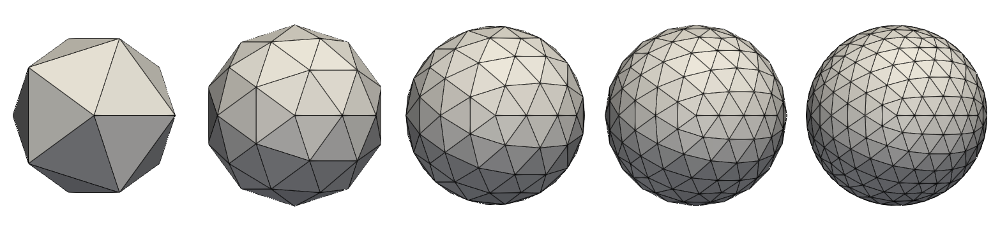

.. _simple_mesh_gen:

######################
Simple mesh generation
######################

.. _dcube_nodal_gen:

Distributed nodal square/cube
-----------------------------

.. doxygenfile:: pdm_dcube_nodal_gen.h
   :project: paradigm

.. _sphere_surf_gen:

Sphere (surface)
----------------

Icosphere
^^^^^^^^^

   Icosphere meshes with increasing subdivision level (from left to right: *n* = 0, 1, 2, 3, 4).

.. _c_api_icosphere:

C API
"""""
.. doxygenfunction:: PDM_sphere_surf_icosphere_gen

.. doxygenfunction:: PDM_sphere_surf_icosphere_gen_nodal

.. doxygenfunction:: PDM_sphere_surf_icosphere_gen_part

.. _python_api_icosphere:

Python API
""""""""""
.. autofunction:: Pypdm.Pypdm.sphere_surf_icosphere_gen

.. autofunction:: Pypdm.Pypdm.sphere_surf_icosphere_gen_nodal

.. autofunction:: Pypdm.Pypdm.sphere_surf_icosphere_gen_part

UV Sphere
^^^^^^^^^
.. doxygenfunction:: PDM_sphere_surf_gen

.. doxygenfunction:: PDM_sphere_surf_gen_nodal

.. _sphere_vol_gen:

Ball (volume)
-------------

.. doxygenfile:: pdm_sphere_vol_gen.h
   :project: paradigm

.. _poly_vol_gen:

Polyhedral mesh
---------------

.. doxygenfile:: pdm_poly_vol_gen.h
   :project: paradigm

.. _point_cloud_gen:

Point clouds
------------

.. doxygenfile:: pdm_point_cloud_gen.h
   :project: paradigm

.. _box_gen:

Box sets
--------

.. doxygenfile:: pdm_box_gen.h
   :project: paradigm
