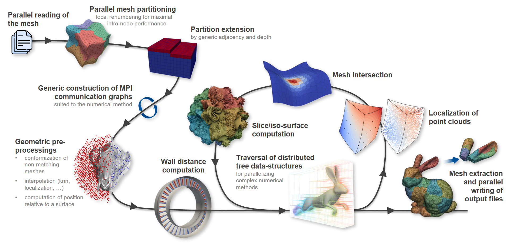

# Summary

**ParaDiGM** (**Para**llel **Di**stributed **G**eneral **M**esh) is an open-source C library (LGPL) designed to overcome the technological bottlenecks associated with geometric data handling and mesh manipulation in massively parallel numerical simulations. Originally developed as the geometric engine for the *CWIPI* coupling library [@Quemerais2026], it has evolved into a standalone infrastructure designed to manage distributed meshes at the billion-element scale and beyond.

Unlike traditional mesh infrastructures, ParaDiGM acts as a **non-intrusive progressive middleware**. It provides solvers (CFD, structural mechanics, high-order Discontinuous Galerkin) with a suite of low-level services for hybrid partitioning, point cloud location, and wall distance computation, all while ensuring the dynamic load balancing essential for **exascale** performance. With native APIs for **C/C++**, **Fortran**, and **Python/NumPy**, ParaDiGM seamlessly integrates into existing production codes—such as *CEDRE* [@Refloch2011], *elsA* [@Cambier2013], *SoNiCS* [@lienhardt2025] or *Maia* [@Coulet2026] — transforming static data structures into dynamic and highly scalable geometric environments.

# Statement of Need

**ParaDiGM** originated from the need to provide high-performance field projection capabilities in the context of multi-physics coupling, as required by the *CWIPI* coupling library [@Quemerais2026]. This initial use case — efficiently locating points across distributed meshes and interpolating physical fields between non-conforming discretizations — exposed the broader bottlenecks that any geometric middleware must address at scale.

In the era of exascale computing, numerical simulation faces a critical paradigm shift. In **Computational Fluid Dynamics (CFD)**, mesh management can no longer rely on centralized or semi-distributed approaches. Integrating distributed mesh capabilities into existing production solvers often encounters major architectural and performance barriers.

Geometric algorithms, once confined to pre-processing, are now required repeatedly within the solver's main execution loop. Modern studies involve evolving meshes, driven either by moving bodies or Dynamic Mesh Adaptation. Whether computing wall distances for turbulence modeling or performing mesh repartitioning, these operations must deliver execution times of the same order of magnitude as a solver iteration — failing to meet this constraint creates a performance bottleneck that severely penalizes overall simulation efficiency. A further challenge lies in data distribution: the initial partition provided to geometric algorithms is typically optimized for physical computation, which is often sub-optimal for geometric operations. Without internal dynamic load balancing, these operations create computation imbalances and memory bottlenecks, compromising simulation execution at very large scale.

# State of the Field

Several parallel mesh management frameworks exist, each addressing different aspects of distributed geometric computing. General-purpose platforms such as *Trilinos* [@Heroux2005] and *Arcane* [@Grospellier2009] provide rich object hierarchies but impose significant architectural constraints on host solvers. Data exchange platforms such as *Salome* (MED format) [@Ribes2007] rely on monolithic data models that introduce memory overhead incompatible with optimized solvers at scale. Mesh generation tools such as *Gmsh* [@Geuzaine2009] cover the CAD-to-mesh pipeline but do not address the in-solver geometric operations required by modern adaptive simulations.

At a lower level, *MOAB* [@Tautges2004] shares several design principles with **ParaDiGM**: a Structure-of-Arrays (SOA) memory layout, and native APIs for C, Fortran, and Python/NumPy. **ParaDiGM** extends this philosophy by interpreting elements of arbitrary order regardless of their internal node numbering convention, and by leveraging element shape functions directly within geometric algorithms such as point cloud location — a capability not prominently exposed in *MOAB*'s core algorithms. The *PUMI* library [@Ibanez2016], by contrast, provides a strongly C++-oriented API, which can limit its integration into legacy Fortran or C production solvers. **ParaDiGM** fills the remaining gap as a non-intrusive middleware: it operates on simple CSR arrays, integrates without refactoring the host solver, and delivers dynamically load-balanced geometric services compatible with solver iteration frequencies.

# Software Design

**ParaDiGM** is a **Software Development Kit (SDK)** rather than a standalone application. Unlike tools like *Gmsh* [@Geuzaine2009], it is not intended for mesh generation from **CAD** models. Its role begins **as soon as a first mesh is obtained**: it provides solvers with the low-level functions needed to distribute, partition, and manipulate discretized meshes in a parallel fashion.

Figure 1 illustrates the various functionalities provided by ParaDiGM that can be leveraged by a numerical simulation software throughout its execution pipeline. Its philosophy is built on three pillars:

1.  **Interoperability and Agnosticism:** Ensuring full compatibility with legacy languages (Fortran, C) and modern environments (Python/NumPy) for a wide variety of numerical methods (Finite Volumes, Finite Elements, high-order Discontinuous Galerkin).
2.  **Hybrid Partitioning Strategy:** ParaDiGM unifies third-party solutions (e.g., *PT-Scotch* [@Chevalier2008], *ParMetis* [@Karypis1997]) while supplementing them with native high-performance algorithms like **Space Filling Curves (SFC)** for frequent repartitioning.
3.  **Total Distribution and Geometric Performance:** By ensuring homogeneous load distribution, the framework has enabled the development of highly efficient algorithms, such as **distributed point cloud location** [@Andrieu2026], achieving performance levels compatible with solver iteration frequencies.

{ width=100% }

# Research Impact Statement

As a high-performance middleware, ParaDiGM provides essential geometric services—such as parallel wall distance computation, point cloud location, and dynamic repartitioning—to various **numerical simulation and pre-processing software**, including *CEDRE* [@Refloch2011], *elsA* [@Cambier2013], *SoNiCS* [@lienhardt2025], *MoDeTheC* [@Dellinger2024] and *Maia* [@Coulet2026]. By generalizing the **Partitioned** and **Distributed View** concepts, it ensures that every stage of the computation remains memory-balanced, even for meshes at the billion-element scale and beyond. With native APIs for **C/C++**, **Fortran**, and **Python/NumPy**, ParaDiGM serves as a versatile infrastructure for aerospace research and large-scale computational physics in the exascale era.

# Conclusion

**ParaDiGM** provides a production-ready, non-intrusive middleware for distributed mesh management at exascale, with demonstrated integration in major aerospace solvers. The library is under active development: ongoing work focuses on porting its most critical components to GPU architectures [@Cazalbou2024], with particular attention to hybrid parallel octree construction and traversal — the most memory- and time-intensive steps in geometric algorithms. By offloading these structures to GPUs, ParaDiGM aims to maintain the load balance and iteration-compatible turnaround times required for next-generation heterogeneous computing environments.

# AI Usage Disclosure

Generative AI tools were used to assist with the writing of this paper: translation, formatting, and improving the fluency of the text. No AI was used in the development of the ParaDiGM software. All scientific content was written and validated by the authors.

# Acknowledgements

The authors would like to thank the following people for their contributions to the development, testing, and dissemination of the ParaDiGM library within the community:

Sébastien Bourasseau¹, Nicolas Lantos¹, Niels Guilbert¹, Alain Hervault¹, Julien Magnenet¹, Lucas Manueco¹, Lionel Matuszewski¹, Yacine Mezemate¹, Bertrand Michel¹, Christina Paulin¹, Christophe Peyret¹, Julien Vanharen¹, Jérôme Esbrat², Victor Pacotte², Bruno Peres² and Mickael Philit³.

¹ ONERA, ² EOLEN, ³ Safran.

The authors also wish to thank BPI France, the Directorate General for Civil Aviation (DGAC), and the General Scientific Directorate of ONERA for their financial support.

# Author Contributions

The contributions to this software are listed according to the CRediT taxonomy:

- **Eric Quémerais**: Conceptualization, Methodology, Software, Validation, Writing – Review & Editing, Project Administration, Funding Acquisition, Supervision.
- **Bastien Andrieu**: Software, Validation, Writing – Original Draft.
- **Bruno Maugars**: Software, Validation.
- **Karmijn Hoogveld**: Software, Validation, Writing – Original Draft.
- **Clément Benazet**: Software, Validation.
- **Julien Coulet**: Software, Validation.
- **Bérenger Berthoul**: Software.
- **Nicolas Dellinger**: Software, Validation.
- **Thomas Hennion**: Software, Validation.

# References