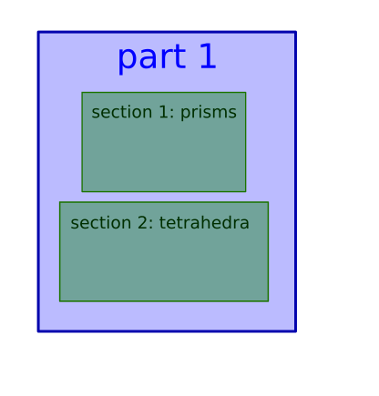

---
jupytext:
  text_representation:
    extension: '.md'
    format_name: myst
    format_version: '0.7'
    jupytext_version: 1.4.0+dev
kernelspec:
  display_name: Python 3
  language: python
  name: python3
---

# Exercise 1 : Mesh partitioning

It's time for some hands on experience with `ParaDiGM`!
Using the API referenced [here](https://numerics.gitlab-pages.onera.net/mesh/paradigm/dev_doc_pretty/user_manual/prepro_algo/index.html#python-api),
you will have fill in the code blocks to partition a mesh, i.e. to cut it in subdomains that will be mapped onto the processors of a parallel machine.
In the first section, we generate a block-distributed cube mesh for you. In the next section, you'll start running the partitioning algorithm.
After that, you will be able to retrieve you the arrays describing the partitionned mesh.

+++

*(Load custom magics)*

```{code-cell}
import os, sys
module_path = os.path.abspath(os.path.join('../../utils'))
if module_path not in sys.path:
    sys.path.append(module_path)
```

```{code-cell}
%reload_ext visu_magics
%reload_ext code_magics
```

+++


## Generate the mesh

In this section, `ParaDiGM` tools are used to generate a simple mesh for this exercise: a cube made of tetrahedra.

```{code-cell}
%%code_block -p exercise_1 -i 1

#include "pdm_multipart.h"
#include "pdm_dcube_nodal_gen.h"
#include "pdm_mesh_nodal.h"
#include "pdm_array.h"
#include "pdm_writer.h"
#include "pdm_writer_priv.h"
#include "pdm_part_connectivity_transform.h"

int main
(
 int   argc,
 char *argv[]
)
{

  // Initialize MPI environment
  int          i_rank = -1;
  int          n_rank = -1;
  PDM_MPI_Comm comm   = PDM_MPI_COMM_WORLD;

  PDM_MPI_Init(&argc, &argv);
  PDM_MPI_Comm_rank(comm, &i_rank);
  PDM_MPI_Comm_size(comm, &n_rank);

  // Generate block-distributed parallelepided mesh
  int                  n_x      = 10;
  int                  n_y      = 10;
  int                  n_z      = 10;
  double               lengthx  = 1.;
  double               xmin     = 0.;
  double               ymin     = 0.;
  double               zmin     = 0.;
  PDM_Mesh_nodal_elt_t elt_type = PDM_MESH_NODAL_TETRA4;
  int                  order    = 1; // call PDM_dcube_nodal_gen_ordering_set if order > 1
  PDM_dcube_nodal_t *dcube = PDM_dcube_nodal_gen_create(comm,
                                                        n_x,
                                                        n_y,
                                                        n_z,
                                                        lengthx,
                                                        xmin,
                                                        ymin,
                                                        zmin,
                                                        elt_type,
                                                        order,
                                                        PDM_OWNERSHIP_USER);

  PDM_dcube_nodal_gen_build (dcube);

  PDM_dmesh_nodal_t *dmn = PDM_dcube_nodal_gen_dmesh_nodal_get(dcube);

  PDM_dmesh_nodal_generate_distribution(dmn);

  // free
  PDM_dcube_nodal_gen_free(dcube);

```

Now that we have our mesh, let's partition it !

## Mesh partitioning

For mesh partitioning, as for all other `ParaDiGM` features, there are 5 main steps:
1. **create** the feature object
2. **set** the data necessary to operate with that feature
3. **compute**, operate the algorithm of the feature
4. **get**, retrieve the ouput of the algorithm
5. **free** the memory allocated to operate the feature

Following this logic, let's start **creating** (step 1) the mesh partitioning object for homogeneously balanced subdomains.

*Remark : since this is a basic example, we ask you to stick with the fixed values for n_zone, n_part, i_zone, i_part and merge_zones.
To get insight about the concepts behind those values you can have a look [here](#Annex 1)*

```{code-cell}
%%code_block -p exercise_1 -i 2

  // Create partitioning object
  int              n_zone      = 1;         // fixed
  int              n_part      = 1;         // fixed
  int              i_zone      = 0;         // fixed
  int              i_part      = 0;         // fixed
  PDM_bool_t       merge_zones = PDM_FALSE; // fixed
  PDM_split_dual_t part_method = PDM_SPLIT_DUAL_WITH_HILBERT;
  PDM_multipart_t *mpart = PDM_multipart_create(n_zone,                    // Number of zones
                                                &n_part,                   // Number of partitions per zone
                                                merge_zones,               // PDM_FALSE (do not fuse zones)
                                                part_method,               // Partitioning method
                                                PDM_PART_SIZE_HOMOGENEOUS, // Subdomains are homogeneously balanced
                                                NULL,                      // Weight (in %) of each partition in heterogeneous case
                                                comm,                      // MPI communicator
                                                PDM_OWNERSHIP_KEEP);       // Data ownership

```

Here, we chose to partition the cube with the Hilbert method. This method implemented in `ParaDiGM` does not ensure the subdomain to be connected.
This method is favored within the `ParaDiGM` algorithms since it provides quickly a good load balance. To ensure the partitions are connected use
`PDM_SPLIT_DUAL_WITH_PARMETIS` or `PDM_SPLIT_DUAL_WITH_PTSCOTCH` which call the external libraries ParMETIS and PT-Scotch.

After mapping the partitionned subdomains on the processors, it is interesting to renumber the entities
of the mesh on each processor for performance through cache blocking but it also provides interesting properties for the application.
You can here call the renumbering function but by telling it not to do any renumbering for a start.

```{code-cell}
%%code_block -p exercise_1 -i 3

  PDM_multipart_set_reordering_options(mpart,
                                       -1,
                                       "PDM_PART_RENUM_CELL_NONE",
                                       NULL,
                                       "PDM_PART_RENUM_FACE_NONE");

```

Now that you have created a mesh partitioning object `mpart`, you can **set** (step 2) the cube mesh to it.

```{code-cell}
%%code_block -p exercise_1 -i 4

  PDM_multipart_register_dmesh_nodal(mpart, i_zone, dmn);
```

At this point you have provided all the information necessary to run the mesh partitioning algorithm. You can call the function to
**compute** (step 3) the subdomains that make up the partitionned cube.

```{code-cell}
%%code_block -p exercise_1 -i 5

  PDM_multipart_run_ppart(mpart);
```

## Get the partitionned mesh

You can now **get** (step 4) the ouput mesh of the partitioning algorithm. Depending on the numerical method, the mesh has to be
described in a different way. For Finite-Element methods a nodal connectivity ([option 1](#Nodal connectivity (i.e. Finite-Element style)))) usually
suffices while for Finite-Volume methods all descending connectivities ([option 2](#Descending connectivity (i.e. Finite-Volume style))) are of interest.
Choose which one suits you best and go further in the exercise to the associated section.

### Nodal connectivity (i.e. Finite-Element style)

You choose to get the partitioned mesh in nodal connectivity, i.e. cell->vertex connectivity.

*Remark : The object in `ParaDiGM` in which partitionned nodal meshes are stored is `part_mesh_nodal`.
Here we get this object from `mpart` to directly have access to the arrays we are interested in.*

Let's start with the vertices composing the subdomain. How many vertices are there? What is their global number? What are their coordiantes?

```{code-cell}
%%code_block -p exercise_1 -i 6

//  double *coords = NULL;
//  int n_vtx = PDM_multipart_part_vtx_coord_get(mpart,
//                                               i_zone,
//                                               i_part,
//                                               &coords,
//                                               PDM_OWNERSHIP_USER);
//
//  PDM_part_mesh_nodal_t *pmn  = NULL;
//  PDM_multipart_get_part_mesh_nodal(mpart,
//                                    i_zone,
//                                    &pmn,
//                                    PDM_OWNERSHIP_USER);
//
//  PDM_g_num_t *vtx_ln_to_gn = PDM_part_mesh_nodal_vtx_g_num_get(pmn,
//                                                                i_part);


```

Let's move on to the cells. How are the vertices connected to form cells? What is their global number? How many cells are there?

*Remark : since this is a basic example, we ask you to stick with the fixed value for i_section.
To get insight about the concept behind this value you can have a look [here](#Annex 1)*

```{code-cell}
%%code_block -p exercise_1 -i 7

//  int i_section = 0; // fixed
//
//  int         *elt_vtx             = NULL;
//  PDM_g_num_t *elt_ln_to_gn        = NULL;
//  int         *parent_num          = NULL;
//  PDM_g_num_t *parent_entity_g_num = NULL;
//  PDM_part_mesh_nodal_section_std_get(pmn,
//                                      i_section,
//                                      i_part,
//                                      &elt_vtx,
//                                      &elt_ln_to_gn,
//                                      &parent_num,
//                                      &parent_entity_g_num,
//                                      PDM_OWNERSHIP_USER);
//
//  int n_elt = PDM_part_mesh_nodal_section_n_elt_get(pmn,
//                                                    i_section,
//                                                    i_part);
//
//  // free
//  free(parent_num);
//  free(parent_entity_g_num);

```

Now we write the mesh that we just got to be able to visualize it later on (nothing to do).

```{code-cell}
%%code_block -p exercise_1 -i 8

//  writer_wrapper(comm,
//                 "visu",
//                 "pmesh",
//                 1, // n_part
//                 &n_vtx,
//                 &coords,
//                 &vtx_ln_to_gn,
//                 &n_elt,
//                 NULL, // elt_vtx_idx
//                 &elt_vtx,
//                 &elt_ln_to_gn,
//                 PDM_WRITER_TETRA4,
//                 0, // n_face
//                 NULL, // cell_face_idx
//                 NULL, // cell_face
//                 "Ensight",
//                 0, // n_elt_field
//                 NULL, // elt_field_name
//                 NULL, // elt_field_values
//                 0, // n_vtx_field
//                 NULL, // vtx_field_name
//                 NULL); // vtx_field_values
//
//  // free
//  free(elt_vtx);
//  free(elt_ln_to_gn);
//  free(coords);
//  PDM_part_mesh_nodal_free(pmn);

```

### Descending connectivity (i.e. Finite-Volume style)

You choose to get the partitioned mesh in descending connectivity, i.e. cell->face, face->edge and edge->vtx connectivities.

Let's start from the top with cell data. How many cells are there? What is their global number? Which faces compose the cells?

```{code-cell}
%%code_block -p exercise_1 -i 9

  PDM_g_num_t *cell_ln_to_gn = NULL;
  int n_cell = PDM_multipart_part_ln_to_gn_get(mpart,
                                              i_zone,
                                              i_part,
                                              PDM_MESH_ENTITY_CELL,
                                              &cell_ln_to_gn,
                                              PDM_OWNERSHIP_USER);

  int *cell_face_idx = NULL;
  int *cell_face     = NULL;
  PDM_multipart_part_connectivity_get(mpart,
                                      i_zone,
                                      i_part,
                                      PDM_CONNECTIVITY_TYPE_CELL_FACE,
                                      &cell_face,
                                      &cell_face_idx,
                                      PDM_OWNERSHIP_USER);

```

For the faces we proceed in a similar way. How many faces are there? What is their global number? Which edges compose the faces?

```{code-cell}
%%code_block -p exercise_1 -i 10

  PDM_g_num_t *face_ln_to_gn = NULL;
  int n_face = PDM_multipart_part_ln_to_gn_get(mpart,
                                              i_zone,
                                              i_part,
                                              PDM_MESH_ENTITY_FACE,
                                              &face_ln_to_gn,
                                              PDM_OWNERSHIP_USER);

  int *face_edge_idx = NULL;
  int *face_edge     = NULL;
  PDM_multipart_part_connectivity_get(mpart,
                                      i_zone,
                                      i_part,
                                      PDM_CONNECTIVITY_TYPE_FACE_EDGE,
                                      &face_edge,
                                      &face_edge_idx,
                                      PDM_OWNERSHIP_USER);

```

Let's do the same for edges. How many edges are there? What is their global number? Which vertices compose the edges?

*Remark : The edge->vertex connectivity index is not created in the `mpart` object since it is implicit. Indeed,
each edge is only composed of two vertices*

```{code-cell}
%%code_block -p exercise_1 -i 11

  PDM_g_num_t *edge_ln_to_gn = NULL;
  int n_edge = PDM_multipart_part_ln_to_gn_get(mpart,
                                              i_zone,
                                              i_part,
                                              PDM_MESH_ENTITY_EDGE,
                                              &edge_ln_to_gn,
                                              PDM_OWNERSHIP_USER);

  int *edge_vtx_idx = NULL;
  int *edge_vtx     = NULL;
  PDM_multipart_part_connectivity_get(mpart,
                                      i_zone,
                                      i_part,
                                      PDM_CONNECTIVITY_TYPE_EDGE_VTX,
                                      &edge_vtx,
                                      &edge_vtx_idx,
                                      PDM_OWNERSHIP_USER);

  if (edge_vtx_idx != NULL) free (edge_vtx_idx);


```

To finish with, we need to have the description of the vertices.

```{code-cell}
%%code_block -p exercise_1 -i 12

  PDM_g_num_t *vtx_ln_to_gn = NULL;
  int n_vtx = PDM_multipart_part_ln_to_gn_get(mpart,
                                              i_zone,
                                              i_part,
                                              PDM_MESH_ENTITY_VERTEX,
                                              &vtx_ln_to_gn,
                                              PDM_OWNERSHIP_USER);

  double *coords = NULL;
  PDM_multipart_part_vtx_coord_get(mpart,
                                   i_zone,
                                   i_part,
                                   &coords,
                                   PDM_OWNERSHIP_USER);

```

Now we write the mesh that we just got to be able to visualize it later on (nothing to do).

```{code-cell}
%%code_block -p exercise_1 -i 13

  int *face_vtx = NULL;
  PDM_compute_face_vtx_from_face_and_edge(n_face,
                                          face_edge_idx,
                                          face_edge,
                                          edge_vtx,
                                          &face_vtx);

  int *face_vtx_idx = malloc(sizeof(int) * (n_face+1));
  for (int i = 0; i < n_face + 1; i++) {
    face_vtx_idx[i] = 3 * i; // triangle
  }

  writer_wrapper(comm,
                "visu",
                "pmesh",
                1, // n_part
                &n_vtx,
                &coords,
                &vtx_ln_to_gn,
                &n_cell,
                &face_vtx_idx,
                &face_vtx,
                &cell_ln_to_gn,
                -1, // cell_t
                &n_face,
                &cell_face_idx,
                &cell_face,
                "Ensight",
                0, // n_elt_field
                NULL, // elt_field_name
                NULL, // elt_field_values
                0, // n_vtx_field
                NULL, // vtx_field_name
                NULL); // vtx_field_values

  // free
  free(face_vtx_idx);
  free(face_vtx);
  free(vtx_ln_to_gn);
  free(coords);
  free(edge_ln_to_gn);
  free(edge_vtx_idx);
  free(edge_vtx);
  free(face_ln_to_gn);
  free(face_edge_idx);
  free(face_edge);
  free(cell_ln_to_gn);
  free(cell_face_idx);
  free(cell_face);
```

Once the partitionned mesh retrieved we can **free** (step 5) the memory allocated for and by the partitioning algorithm.

```{code-cell}
%%code_block -p exercise_1 -i 14

  // free
  PDM_DMesh_nodal_free(dmn);
  PDM_multipart_free(mpart);

  // Finalize MPI environment
  PDM_MPI_Finalize();

  if (i_rank == 0) {
    printf("End :)\n");
  }

  return 0;
}
```

## Execution and visualization

Run the following cells to execute to program you just wrote and visualize the partitionned output mesh.

```{code-cell}
%merge_code_blocks -l c -p exercise_1 -n 2 -c
```

```{code-cell}
%%visualize
visu/PMESH.case : i_part
```

## Annex 1

In certain settings, the mesh is an assembly of several sub-meshes. These are called *zones*.


Each zone *zone* is partitionned in subdomains which
are mapped to the processors of the parallel machine. On a processor the subdomain (of a mesh or a zone) can be sudivided in *parts*.


A mesh can be composed of several element types (tetrahedra, hexahedra, prisms...). In certain settings, the mesh definition for each specific element type
is stored in a seperate *section*. So in a *section* one will find data for a specific element type.


