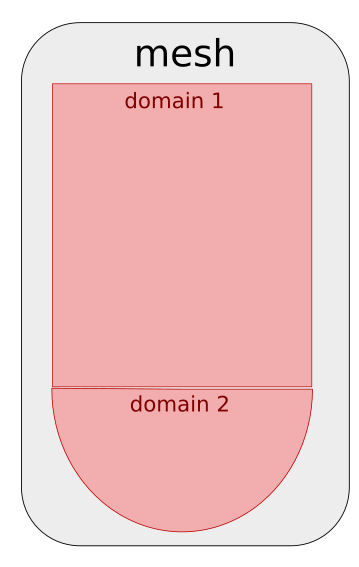

---
jupytext:
  text_representation:
    extension: '.md'
    format_name: myst
    format_version: '0.7'
    jupytext_version: 1.4.0+dev
kernelspec:
  display_name: Python 3
  language: python
  name: python3
---

# Exercise 1 : Mesh partitioning

It's time for some hands on experience with `ParaDiGM`!
Using the API referenced [here](https://numerics.gitlab-pages.onera.net/mesh/paradigm/dev/user_manual/partitioning/multipart.html#Fortran-API),
you will have to fill in the code cells to partition a mesh, i.e. to cut it in subdomains that will be mapped onto the processors of a parallel machine.
In the first section, we generate a block-distributed cube mesh for you. In the next section, you'll start running the partitioning algorithm.
After that, you will be able to retrieve the arrays describing the partitioned mesh.

+++

*(Load custom magics)*

```{code-cell}
import os, sys
module_path = os.path.abspath(os.path.join('../../utils'))
if module_path not in sys.path:
    sys.path.append(module_path)
```

```{code-cell}
%reload_ext visu_magics
%reload_ext code_magics
```

+++

Fortran forces to define the variables at the top of the program.
In this notebook, we define the variables you need for a given function call in a seperate cell above the one you will fill in.

```{code-cell}
%%code_block -p exercise_1 -i 1

program pdm_t_mesh_partitioning_f

  use pdm
  use pdm_multipart
  use pdm_vtk
  use pdm_dcube_nodal_gen
  use pdm_dmesh_nodal
  use pdm_part_mesh_nodal
  use pdm_mesh_nodal
  use iso_c_binding
  use pdm_fortran
  use pdm_writer_wrapper
  use pdm_part_connectivity_transform
  use pdm_part_extension

  implicit none

  include "mpif.h"

  !-----------------------------------------------------------
  integer (c_int)    :: i

  ! MPI
  integer            :: code
  integer            :: i_rank
  integer            :: n_rank
  integer, parameter :: comm = MPI_COMM_WORLD

  ! Mesh generation with dcube_nodal_gen
  integer          :: n_x, n_y, n_z
  integer          :: elt_type, order
  double precision :: length
  double precision :: xmin, ymin, zmin
  type (c_ptr)     :: dcube
  type (c_ptr)     :: dmn

```

## Generate the mesh

In this section, `ParaDiGM` tools are used to generate a simple mesh for this exercise: a cube made of tetrahedra.
You have nothing to do here. Still if you are curious about this feature, you can have a look [here](https://numerics.gitlab-pages.onera.net/mesh/paradigm/dev/user_manual/simple_mesh_gen/dcube_nodal.html#Fortran-API).

```{code-cell}
%%code_block -p exercise_1 -i 17

  ! Initialize MPI environment
  call mpi_init(code)
  call mpi_comm_rank(comm, i_rank, code)
  call mpi_comm_size(comm, n_rank, code)

  ! Generate block-distributed parallelepided mesh
  n_x      = 10
  n_y      = 10
  n_z      = 10
  length   = 1.
  xmin     = 0.
  ymin     = 0.
  zmin     = 0.
  elt_type = PDM_MESH_NODAL_TETRA4
  order    = 1
  call PDM_dcube_nodal_gen_create(dcube,     &
                                  comm,      &
                                  n_x,       &
                                  n_y,       &
                                  n_z,       &
                                  length,    &
                                  xmin,      &
                                  ymin,      &
                                  zmin,      &
                                  elt_type,  &
                                  order,     &
                                  PDM_OWNERSHIP_USER)

  call PDM_dcube_nodal_gen_build(dcube, dmn)

  call PDM_dcube_nodal_gen_dmesh_nodal_get(dcube, dmn)

  call PDM_dmesh_nodal_generate_distribution(dmn)

  call PDM_dcube_nodal_gen_free(dcube)

```

Now that we have our mesh, let's partition it !

## Mesh partitioning

For mesh partitioning, as for all other `ParaDiGM` features, there are 5 main steps:
1. **create** the feature object
2. **set** the data necessary to operate with that feature
3. **compute**, operate the algorithm of the feature
4. **get**, retrieve the output of the algorithm
5. **free** the memory allocated to operate the feature

Following this logic, let's start **creating** (step 1) the mesh partitioning object for homogeneously balanced subdomains.

```{code-cell}
%%code_block -p exercise_1 -i 2

  type (c_ptr)                       :: mpart
  integer (c_int)                    :: n_domain = 1
  integer(kind=PDM_l_num_s), pointer :: n_part(:)                => null()
  integer (c_int)                    :: part_method, merge_domains
  double precision,          pointer :: part_fraction(:)         => null()
  integer (c_int)                    :: i_domain = 0
  integer (c_int)                    :: i_part   = 0
```
*Remark : since this is a basic example, we ask you to stick with the fixed values for n_domain, n_part, i_domain, i_part and merge_domains.
To get insight about the concepts behind those values you can have a look [here](#Annex-1)*

```{code-cell}
%%code_block -p exercise_1 -i 18

  ! Create partitioning object
  allocate(n_part(n_domain))

  do i = 1, n_domain
    n_part(i) = 1
  end do

  allocate(part_fraction(n_part(i_domain+1)))

  do i = 1, n_part(i_domain+1)
    part_fraction(i) = 1
  end do

  merge_domains = PDM_FALSE
  part_method = PDM_SPLIT_DUAL_WITH_HILBERT
  call PDM_multipart_create(mpart,                     & ! Mesh partitioning object
                            n_domain,                  & ! Number of domains
                            n_part,                    & ! Number of partitions per domain
                            merge_domains,             & ! PDM_FALSE (do not fuse domains)
                            part_method,               & ! Partitioning method
                            PDM_PART_SIZE_HOMOGENEOUS, & ! Subdomains are homogeneously balanced
                            part_fraction,             & ! Weight (in %) of each partition in heterogeneous case
                            comm,                      & ! MPI communicator
                            PDM_OWNERSHIP_KEEP)          ! Data ownership


```

Here, we chose to partition the cube with the Hilbert method. This method implemented in `ParaDiGM` does not ensure the subdomain to be connected.
This method is favored within the `ParaDiGM` algorithms since it provides quickly a good load balance. To ensure the partitions are connected use
`PDM_SPLIT_DUAL_WITH_PARMETIS` or `PDM_SPLIT_DUAL_WITH_PTSCOTCH` which call the external libraries ParMETIS and PT-Scotch.

After mapping the partitioned subdomains on the processors, it is interesting to renumber the entities
of the mesh on each processor for performance through cache blocking but it also provides interesting properties for the application.
You can here call the renumbering function but by telling it not to do any renumbering for a start.

```{code-cell}
%%code_block -p exercise_1 -i 3

  integer(kind=PDM_l_num_s), pointer    :: renum_cell_properties(:) => null()
```

```{code-cell}
%%code_block -p exercise_1 -i 19

  call PDM_multipart_set_reordering_options(mpart,                      &
                                            i_domain,                   &
                                            "PDM_PART_RENUM_CELL_NONE", &
                                            renum_cell_properties,      &
                                            "PDM_PART_RENUM_FACE_NONE")

```

Now that you have created a mesh partitioning object `mpart`, you can **set** (step 2) the cube mesh to it.

```{code-cell}
%%code_block -p exercise_1 -i 20

  call PDM_multipart_dmesh_nodal_set(mpart,    &
                                     i_domain, &
                                     dmn)

```

At this point you have provided all the information necessary to run the mesh partitioning algorithm. You can call the function to
**compute** (step 3) the subdomains that make up the partitioned cube.

```{code-cell}
%%code_block -p exercise_1 -i 21

  call PDM_multipart_compute(mpart)
```

## Get the partitioned mesh

You can now **get** (step 4) the output mesh of the partitioning algorithm. Depending on the numerical method, the mesh has to be
described in a different way. For Finite-Element methods a nodal connectivity ([option 1](#Nodal-connectivity-(i.e.-Finite-Element-style)))) usually
suffices while for Finite-Volume methods all descending connectivities ([option 2](#Descending-connectivity-(i.e.-Finite-Volume-style))) are of interest.
Choose which one suits you best and go further in the exercise to the associated section.

### Nodal connectivity (i.e. Finite-Element style)

You choose to get the partitioned mesh in nodal connectivity, i.e. cell->vertex connectivity.

*Remark : The object in `ParaDiGM` in which partitioned nodal meshes are stored is `part_mesh_nodal`.
Here we get this object from `mpart` to have a direct access to the arrays we are interested in.
For more information about this structure, have a look [here](https://numerics.gitlab-pages.onera.net/mesh/paradigm/dev/user_manual/partitioning/multipart.html#Partitionned-nodal-mesh-2)*

```{code-cell}
%%code_block -p exercise_1 -i 4

  ! type (c_ptr) :: pmn
```

Let's start with the vertices composing the subdomain. How many vertices are there? What are their global ids? What are their coordinates?

```{code-cell}
%%code_block -p exercise_1 -i 5

  ! double precision,      pointer :: coords(:,:)     => null()
  ! integer(c_int)                 :: n_vtx
  ! integer (pdm_g_num_s), pointer :: vtx_ln_to_gn(:) => null()
```

```{code-cell}
%%code_block -p exercise_1 -i 22

  ! call PDM_multipart_part_vtx_coord_get(mpart,              &
  !                                       i_domain,           &
  !                                       i_part,             &
  !                                       coords,             &
  !                                       PDM_OWNERSHIP_USER, &
  !                                       n_vtx)


  ! call PDM_multipart_get_part_mesh_nodal(mpart,    &
  !                                        i_domain, &
  !                                        pmn,      &
  !                                        PDM_OWNERSHIP_USER)


  ! call PDM_part_mesh_nodal_vtx_g_num_get(pmn,    &
  !                                        i_part, &
  !                                        vtx_ln_to_gn)

```

Let's move on to the cells. How are the vertices connected to form cells? What are their global ids? How many cells are there?

*Remark : since this is a basic example, we ask you to stick with the fixed value for i_section.
To get insight about the concept behind this value you can have a look [here](#Annex-1)*

```{code-cell}
%%code_block -p exercise_1 -i 6

  ! integer (c_int)                     :: n_elt
  ! integer(kind=PDM_l_num_s), pointer  :: elt_vtx(:)             => null()
  ! integer (pdm_g_num_s),     pointer  :: elt_ln_to_gn(:)        => null()
  ! integer(kind=PDM_l_num_s), pointer  :: parent_num(:)          => null()
  ! integer (pdm_g_num_s),     pointer  :: parent_entity_g_num(:) => null()
  ! integer (c_int)                     :: i_section = 0
```

```{code-cell}
%%code_block -p exercise_1 -i 23

  ! call PDM_part_mesh_nodal_section_n_elt_get(pmn,       &
  !                                            i_section, &
  !                                            i_part,    &
  !                                            n_elt)

  ! call PDM_part_mesh_nodal_section_std_get(pmn,                 &
  !                                          i_section,           &
  !                                          i_part,              &
  !                                          elt_vtx,             &
  !                                          elt_ln_to_gn,        &
  !                                          parent_num,          &
  !                                          parent_entity_g_num, &
  !                                          PDM_OWNERSHIP_KEEP)

```

Now we write the mesh that we just got to be able to visualize it later on (nothing to do).

```{code-cell}
%%code_block -p exercise_1 -i 7

  ! integer(pdm_l_num_s),      pointer :: pn_vtx(:)
  ! integer(pdm_l_num_s),      pointer :: pn_elt(:)

  ! type(PDM_pointer_array_t), pointer :: pcoords       => null()
  ! type(PDM_pointer_array_t), pointer :: pvtx_ln_to_gn => null()
  ! type(PDM_pointer_array_t), pointer :: pelt_vtx      => null()
  ! type(PDM_pointer_array_t), pointer :: pelt_ln_to_gn => null()
```

```{code-cell}
%%code_block -p exercise_1 -i 24

  ! allocate(pn_vtx(1), &
  !          pn_elt(1))

  ! pn_vtx(1) = n_vtx
  ! pn_elt(1) = n_elt

  ! call PDM_pointer_array_create(pcoords,        1, PDM_TYPE_DOUBLE)
  ! call PDM_pointer_array_create(pvtx_ln_to_gn,  1, PDM_TYPE_G_NUM)
  ! call PDM_pointer_array_create(pelt_vtx,       1, PDM_TYPE_INT)
  ! call PDM_pointer_array_create(pelt_ln_to_gn,  1, PDM_TYPE_G_NUM)

  ! call PDM_pointer_array_part_set(pcoords,       0, coords)
  ! call PDM_pointer_array_part_set(pvtx_ln_to_gn, 0, vtx_ln_to_gn)
  ! call PDM_pointer_array_part_set(pelt_vtx,      0, elt_vtx)
  ! call PDM_pointer_array_part_set(pelt_ln_to_gn, 0, elt_ln_to_gn)

  ! call writer_wrapper(comm,          &
  !                     "visu",        &
  !                     "pmesh",       &
  !                     1,             &
  !                     pn_vtx,        &
  !                     pcoords,       &
  !                     pvtx_ln_to_gn, &
  !                     pn_elt,        &
  !                     pelt_vtx_idx,  &
  !                     pelt_vtx,      &
  !                     pelt_ln_to_gn, &
  !                     cell_t = elt_type)

  ! call PDM_pointer_array_free(pcoords)
  ! call PDM_pointer_array_free(pvtx_ln_to_gn)
  ! call PDM_pointer_array_free(pelt_vtx)
  ! call PDM_pointer_array_free(pelt_ln_to_gn)

  ! deallocate(pn_vtx, &
  !            pn_elt)

  ! call PDM_part_mesh_nodal_free(pmn)
```

### Descending connectivity (i.e. Finite-Volume style)

You choose to get the partitioned mesh in descending connectivity, i.e. cell->face, face->edge and edge->vtx connectivities.

Let's start from the top with cell data. How many cells are there? What are their global ids? Which faces compose the cells?

```{code-cell}
%%code_block -p exercise_1 -i 8

  integer(kind=PDM_g_num_s), pointer :: cell_ln_to_gn(:) => null()
  integer(c_int)                     :: n_cell
  integer(kind=PDM_l_num_s), pointer :: cell_face(:)     => null()
  integer(kind=PDM_l_num_s), pointer :: cell_face_idx(:) => null()
```

```{code-cell}
%%code_block -p exercise_1 -i 25

  call PDM_multipart_part_ln_to_gn_get(mpart,                &
                                       i_domain,             &
                                       i_part,               &
                                       PDM_MESH_ENTITY_CELL, &
                                       cell_ln_to_gn,        &
                                       PDM_OWNERSHIP_KEEP,   &
                                       n_cell)

  call PDM_multipart_part_connectivity_get(mpart,                           &
                                           i_domain,                        &
                                           i_part,                          &
                                           PDM_CONNECTIVITY_TYPE_CELL_FACE, &
                                           cell_face_idx,                   &
                                           cell_face,                       &
                                           PDM_OWNERSHIP_KEEP,              &
                                           n_cell)

```

For the faces we proceed in a similar way. How many faces are there? What are their global ids? Which edges compose the faces?

```{code-cell}
%%code_block -p exercise_1 -i 9

  integer(kind=PDM_g_num_s), pointer :: face_ln_to_gn(:) => null()
  integer(c_int)                     :: n_face
  integer(kind=PDM_l_num_s), pointer :: face_edge(:)     => null()
  integer(kind=PDM_l_num_s), pointer :: face_edge_idx(:)
```

```{code-cell}
%%code_block -p exercise_1 -i 26

  call PDM_multipart_part_ln_to_gn_get(mpart,                &
                                       i_domain,             &
                                       i_part,               &
                                       PDM_MESH_ENTITY_FACE, &
                                       face_ln_to_gn,        &
                                       PDM_OWNERSHIP_KEEP,   &
                                       n_face)

  call PDM_multipart_part_connectivity_get(mpart,                           &
                                           i_domain,                        &
                                           i_part,                          &
                                           PDM_CONNECTIVITY_TYPE_FACE_EDGE, &
                                           face_edge_idx,                   &
                                           face_edge,                       &
                                           PDM_OWNERSHIP_KEEP,              &
                                           n_face)

```

Let's do the same for edges. How many edges are there? What are their global ids? Which vertices compose the edges?

```{code-cell}
%%code_block -p exercise_1 -i 10

  integer(kind=PDM_g_num_s), pointer :: edge_ln_to_gn(:) => null()
  integer(c_int)                     :: n_edge
  integer(kind=PDM_l_num_s), pointer :: edge_vtx(:)      => null()
  integer(kind=PDM_l_num_s), pointer :: edge_vtx_idx(:)  => null()
```

*Remark : The edge->vertex connectivity index is not created in the `mpart` object since it is implicit. Indeed,
each edge is only composed of two vertices*

```{code-cell}
%%code_block -p exercise_1 -i 27

  call PDM_multipart_part_ln_to_gn_get(mpart,                &
                                       i_domain,             &
                                       i_part,               &
                                       PDM_MESH_ENTITY_EDGE, &
                                       edge_ln_to_gn,        &
                                       PDM_OWNERSHIP_KEEP,   &
                                       n_edge)

  call PDM_multipart_part_connectivity_get(mpart,                          &
                                           i_domain,                       &
                                           i_part,                         &
                                           PDM_CONNECTIVITY_TYPE_EDGE_VTX, &
                                           edge_vtx_idx,                   &
                                           edge_vtx,                       &
                                           PDM_OWNERSHIP_KEEP,             &
                                           n_edge)

```

To finish with, we need to have the description of the vertices.

```{code-cell}
%%code_block -p exercise_1 -i 11

  double precision,      pointer :: coords(:,:)     => null()
  integer(c_int)                 :: n_vtx
  integer (pdm_g_num_s), pointer :: vtx_ln_to_gn(:) => null()
```

```{code-cell}
%%code_block -p exercise_1 -i 28

  call PDM_multipart_part_ln_to_gn_get(mpart,                  &
                                       i_domain,               &
                                       i_part,                 &
                                       PDM_MESH_ENTITY_VERTEX, &
                                       vtx_ln_to_gn,           &
                                       PDM_OWNERSHIP_KEEP,     &
                                       n_vtx)

  call PDM_multipart_part_vtx_coord_get(mpart,             &
                                       i_domain,           &
                                       i_part,             &
                                       coords,             &
                                       PDM_OWNERSHIP_KEEP, &
                                       n_vtx)

```

Now we write the mesh that we just got to be able to visualize it later on (nothing to do).

```{code-cell}
%%code_block -p exercise_1 -i 12

  integer(pdm_l_num_s),      pointer :: pn_vtx(:)
  integer(pdm_l_num_s),      pointer :: pn_elt(:)
  integer(pdm_l_num_s),      pointer :: pn_face(:)

  type(PDM_pointer_array_t), pointer :: pcoords        => null()
  type(PDM_pointer_array_t), pointer :: pvtx_ln_to_gn  => null()
  type(PDM_pointer_array_t), pointer :: pelt_vtx_idx   => null()
  type(PDM_pointer_array_t), pointer :: pelt_vtx       => null()
  type(PDM_pointer_array_t), pointer :: pelt_ln_to_gn  => null()
  type(PDM_pointer_array_t), pointer :: pcell_face_idx => null()
  type(PDM_pointer_array_t), pointer :: pcell_face     => null()

  integer(PDM_l_num_s),      pointer :: face_vtx_idx(:) => null()
  integer(PDM_l_num_s),      pointer :: face_vtx(:)     => null()
```

```{code-cell}
%%code_block -p exercise_1 -i 29

  allocate(pn_vtx(1), &
           pn_elt(1), &
           pn_face(1))

  pn_vtx(1)  = n_vtx
  pn_elt(1)  = n_cell
  pn_face(1) = n_face

  call PDM_compute_face_vtx_from_face_and_edge(n_face, &
                                               face_edge_idx, &
                                               face_edge, &
                                               edge_vtx, &
                                               face_vtx)

  allocate(face_vtx_idx(n_face+1))

  do i = 1, n_face+1
    face_vtx_idx(i) = 3*(i-1)
  end do

  call PDM_pointer_array_create(pcoords,        1, PDM_TYPE_DOUBLE)
  call PDM_pointer_array_create(pvtx_ln_to_gn,  1, PDM_TYPE_G_NUM)
  call PDM_pointer_array_create(pelt_vtx_idx,   1, PDM_TYPE_INT)
  call PDM_pointer_array_create(pelt_vtx,       1, PDM_TYPE_INT)
  call PDM_pointer_array_create(pelt_ln_to_gn,  1, PDM_TYPE_G_NUM)
  call PDM_pointer_array_create(pcell_face_idx, 1, PDM_TYPE_INT)
  call PDM_pointer_array_create(pcell_face,     1, PDM_TYPE_INT)

  call PDM_pointer_array_part_set(pcoords,        0, coords)
  call PDM_pointer_array_part_set(pvtx_ln_to_gn,  0, vtx_ln_to_gn)
  call PDM_pointer_array_part_set(pelt_vtx_idx,   0, face_vtx_idx)
  call PDM_pointer_array_part_set(pelt_vtx,       0, face_vtx)
  call PDM_pointer_array_part_set(pelt_ln_to_gn,  0, cell_ln_to_gn)
  call PDM_pointer_array_part_set(pcell_face_idx, 0, cell_face_idx)
  call PDM_pointer_array_part_set(pcell_face,     0, cell_face)

  call writer_wrapper(comm,                            &
                      "visu",                          &
                      "pmesh",                         &
                      1,                               &
                      pn_vtx,                          &
                      pcoords,                         &
                      pvtx_ln_to_gn,                   &
                      pn_elt,                          &
                      pelt_vtx_idx,                    &
                      pelt_vtx,                        &
                      pelt_ln_to_gn,                   &
                      n_face         = pn_face,        &
                      pcell_face_idx = pcell_face_idx, &
                      pcell_face     = pcell_face)

  call PDM_pointer_array_free(pcoords)
  call PDM_pointer_array_free(pvtx_ln_to_gn)
  call PDM_pointer_array_free(pelt_vtx_idx)
  call PDM_pointer_array_free(pelt_vtx)
  call PDM_pointer_array_free(pelt_ln_to_gn)
  call PDM_pointer_array_free(pcell_face_idx)
  call PDM_pointer_array_free(pcell_face)

  deallocate(pn_vtx,  &
             pn_elt,  &
             pn_face, &
             face_vtx_idx)
```

## Execution and visualization

First, we finalize the the code you juste wrote by with the last step :  **free** (step 5).

```{code-cell}
%%code_block -p exercise_1 -i 30

  deallocate(n_part, &
             part_fraction)
  call PDM_DMesh_nodal_free(dmn)
  call PDM_multipart_free(mpart)

  ! Finalize MPI environment
  call mpi_finalize(code)

  if (i_rank == 0) then
    print *, "End :)"
  endif

end program pdm_t_mesh_partitioning_f

```

Run the following cells to execute the program you just wrote and visualize the output partitioned mesh.

```{code-cell}
%merge_code_blocks -l fortran -p exercise_1 -n 2 -v
```

```{code-cell}
%%visualize
visu/PMESH.case : i_part
```

## Bonus : Extended partition

If you are reading this, you finished quickly the partitioning exercise. Thus, it means you understood well the 5 step scheme for using `ParaDiGM` features.

*Remark : To do this bonus you need to have retrieved the mesh in descending connectivity. If you haven't done that yet, please comment your
work on nodal connectivities and get the mesh in descending connectivity first.*

In this bonus, we want to get one layer of extended cells by nodes for our mesh partitions.
This bonus is not guided, so you should have a close look at the [documentation](https://numerics.gitlab-pages.onera.net/mesh/paradigm/dev/user_manual/partitioning/part_extension.html#Fortran-API).

### Step 1

```{code-cell}
%%code_block -p exercise_1 -i 13

  type(c_ptr) :: part_ext = C_NULL_PTR
  integer     :: extend_type
  integer     :: depth
```

```{code-cell}
%%code_block -p exercise_1 -i 31

  extend_type = PDM_EXTEND_FROM_VTX
  depth       = 1
  call PDM_part_extension_create (part_ext,           &
                                  n_domain,           &
                                  n_part,             &
                                  extend_type,        & ! Extend from which element
                                  depth,              & ! Depth of the extension
                                  comm,               &
                                  PDM_OWNERSHIP_KEEP)
```

### Step 2

```{code-cell}
%%code_block -p exercise_1 -i 14

  integer                         :: n_face_part_bound = 0
  integer                         :: n_face_group = 0
  integer(PDM_l_num_s), pointer   :: face_cell(:)                => null()
  integer(PDM_l_num_s), pointer   :: face_group_idx(:)           => null()
  integer(PDM_l_num_s), pointer   :: face_group(:)               => null()
  integer(PDM_g_num_s), pointer   :: face_group_ln_to_gn(:)      => null()
  integer(PDM_l_num_s), pointer   :: face_part_bound_proc_idx(:) => null()
  integer(PDM_l_num_s), pointer   :: face_part_bound_part_idx(:) => null()
  integer(PDM_l_num_s), pointer   :: face_part_bound(:)          => null()
  integer(PDM_l_num_s), pointer   :: vtx_part_bound_proc_idx(:)  => null()
  integer(PDM_l_num_s), pointer   :: vtx_part_bound_part_idx(:)  => null()
  integer(PDM_l_num_s), pointer   :: vtx_part_bound(:)           => null()
  integer(PDM_l_num_s), pointer   :: face_join_idx(:)            => null()
  integer(PDM_l_num_s), pointer   :: face_join(:)                => null()
```

```{code-cell}
%%code_block -p exercise_1 -i 32

  call PDM_multipart_part_graph_comm_get(mpart,                   &
                                         i_domain,                &
                                         i_part,                  &
                                         PDM_MESH_ENTITY_VERTEX,  &
                                         vtx_part_bound_proc_idx, &
                                         vtx_part_bound_part_idx, &
                                         vtx_part_bound,          &
                                         PDM_OWNERSHIP_KEEP)

  call PDM_part_extension_set_part (part_ext,                 &
                                    i_domain,                 &
                                    i_part,                   &
                                    n_cell,                   &
                                    n_face,                   &
                                    n_face_part_bound,        &
                                    n_face_group,             &
                                    n_edge,                   &
                                    n_vtx,                    &
                                    cell_face_idx,            &
                                    cell_face,                &
                                    face_cell,                &
                                    face_edge_idx,            &
                                    face_edge,                &
                                    face_vtx_idx,             &
                                    face_vtx,                 &
                                    edge_vtx,                 &
                                    face_group_idx,           &
                                    face_group,               &
                                    face_join_idx,            &
                                    face_join,                &
                                    face_part_bound_proc_idx, &
                                    face_part_bound_part_idx, &
                                    face_part_bound,          &
                                    vtx_part_bound_proc_idx,  &
                                    vtx_part_bound_part_idx,  &
                                    vtx_part_bound,           &
                                    cell_ln_to_gn,            &
                                    face_ln_to_gn,            &
                                    edge_ln_to_gn,            &
                                    vtx_ln_to_gn,             &
                                    face_group_ln_to_gn,      &
                                    coords)
```

### Step 3

```{code-cell}
%%code_block -p exercise_1 -i 33

call PDM_part_extension_compute (part_ext)
```

### Step 4

```{code-cell}
%%code_block -p exercise_1 -i 15

  integer                         :: n_cell_ext
  integer(pdm_l_num_s), pointer   :: cell_face_ext(:)      => null()
  integer(pdm_l_num_s), pointer   :: cell_face_ext_idx(:)  => null()
  integer(PDM_g_num_s), pointer   :: cell_ln_to_gn_ext(:)  => null()

  integer                         :: n_face_ext
  integer(pdm_l_num_s), pointer   :: face_edge_ext(:)      => null()
  integer(pdm_l_num_s), pointer   :: face_edge_ext_idx(:)  => null()
  integer(PDM_g_num_s), pointer   :: face_ln_to_gn_ext(:)  => null()

  integer                         :: n_edge_ext
  integer(pdm_l_num_s), pointer   :: edge_vtx_ext(:)       => null()
  integer(pdm_l_num_s), pointer   :: edge_vtx_ext_idx(:)   => null()
  integer(PDM_g_num_s), pointer   :: edge_ln_to_gn_ext(:)  => null()

  integer                         :: n_vtx_ext
  double precision,     pointer   :: vtx_coord_ext(:,:)    => null()
  integer(PDM_g_num_s), pointer   :: vtx_ln_to_gn_ext(:)   => null()
```

```{code-cell}
%%code_block -p exercise_1 -i 34

  ! Cell
  call PDM_part_extension_ln_to_gn_get (part_ext,             &
                                        i_domain,             &
                                        i_part,               &
                                        PDM_MESH_ENTITY_CELL, &
                                        n_cell_ext,           &
                                        cell_ln_to_gn_ext)

  call PDM_part_extension_connectivity_get (part_ext,                        &
                                            i_domain,                        &
                                            i_part,                          &
                                            PDM_CONNECTIVITY_TYPE_CELL_FACE, &
                                            n_cell_ext,                      &
                                            cell_face_ext_idx,               &
                                            cell_face_ext)

  ! Face
  call PDM_part_extension_ln_to_gn_get (part_ext,             &
                                        i_domain,             &
                                        i_part,               &
                                        PDM_MESH_ENTITY_FACE, &
                                        n_face_ext,           &
                                        face_ln_to_gn_ext)

  call PDM_part_extension_connectivity_get (part_ext,                        &
                                            i_domain,                        &
                                            i_part,                          &
                                            PDM_CONNECTIVITY_TYPE_FACE_EDGE, &
                                            n_face_ext,                      &
                                            face_edge_ext_idx,               &
                                            face_edge_ext)

  ! Edge
  call PDM_part_extension_ln_to_gn_get (part_ext,             &
                                        i_domain,             &
                                        i_part,               &
                                        PDM_MESH_ENTITY_EDGE, &
                                        n_edge_ext,           &
                                        edge_ln_to_gn_ext)

  call PDM_part_extension_connectivity_get (part_ext,                       &
                                            i_domain,                       &
                                            i_part,                         &
                                            PDM_CONNECTIVITY_TYPE_EDGE_VTX, &
                                            n_edge_ext,                     &
                                            edge_vtx_ext_idx,               &
                                            edge_vtx_ext)

  ! Vertices
  call PDM_part_extension_vtx_coord_get (part_ext,      &
                                         i_domain,      &
                                         i_part,        &
                                         n_vtx_ext,     &
                                         vtx_coord_ext)

  call PDM_part_extension_ln_to_gn_get (part_ext,               &
                                        i_domain,               &
                                        i_part,                 &
                                        PDM_MESH_ENTITY_VERTEX, &
                                        n_vtx_ext,              &
                                        vtx_ln_to_gn_ext)
```

### Step 5

Before handling the allocated memory, we output the mesh partition extension (nothing to do).

```{code-cell}
%%code_block -p exercise_1 -i 16

  double precision, pointer          :: total_coords(:,:)      => null()
  integer(c_int)                     :: total_n_vtx

  integer (pdm_g_num_s), pointer     :: total_vtx_ln_to_gn(:)  => null()

  integer(kind=PDM_g_num_s), pointer :: total_edge_ln_to_gn(:) => null()
  integer(c_int)                     :: total_n_edge
  integer(kind=PDM_l_num_s), pointer :: total_edge_vtx(:)      => null()

  integer(kind=PDM_g_num_s), pointer :: total_face_ln_to_gn(:) => null()
  integer(c_int)                     :: total_n_face
  integer(kind=PDM_l_num_s), pointer :: total_face_edge(:)     => null()
  integer(kind=PDM_l_num_s), pointer :: total_face_edge_idx(:) => null()

  integer(kind=PDM_l_num_s), pointer :: total_face_vtx(:)      => null()
  integer(kind=PDM_l_num_s), pointer :: total_face_vtx_idx(:)  => null()

  integer(kind=PDM_g_num_s), pointer :: total_cell_ln_to_gn(:) => null()
  integer(c_int)                     :: total_n_cell
  integer(kind=PDM_l_num_s), pointer :: total_cell_face(:)     => null()
  integer(kind=PDM_l_num_s), pointer :: total_cell_face_idx(:) => null()

  type(my_field_t)                   :: elt_fields(1)
  double precision, pointer          :: total_cell_color(:) => null()

```

```{code-cell}
%%code_block -p exercise_1 -i 35

  ! Visualisation
  total_n_cell = n_cell + n_cell_ext
  total_n_face = n_face + n_face_ext
  total_n_edge = n_edge + n_edge_ext
  total_n_vtx  = n_vtx  + n_vtx_ext

  allocate(total_vtx_ln_to_gn(total_n_vtx), &
           total_coords(3,total_n_vtx),     &
           total_edge_ln_to_gn(total_n_edge), &
           total_edge_vtx(2 * total_n_edge), &
           total_face_ln_to_gn(total_n_face), &
           total_face_edge_idx(total_n_face+1), &
           total_cell_ln_to_gn(total_n_cell), &
           total_cell_face_idx(total_n_cell+1))

  ! Cell
  do i = 1, n_cell
    total_cell_ln_to_gn(i) = cell_ln_to_gn(i)
  end do
  do i = 1, n_cell_ext
    total_cell_ln_to_gn(n_cell + i) = cell_ln_to_gn_ext(i)
  end do

  do i = 1, n_cell+1
    total_cell_face_idx(i) = cell_face_idx(i)
  end do
  do i = 1, n_cell_ext+1
    total_cell_face_idx(n_cell + i) = cell_face_idx(n_cell + 1) + cell_face_ext_idx(i)
  end do

  ! Face
  do i = 1, n_face
    total_face_ln_to_gn(i) = face_ln_to_gn(i)
  end do
  do i = 1, n_face_ext
    total_face_ln_to_gn(n_face + i) = face_ln_to_gn_ext(i)
  end do

  do i = 1, n_face+1
    total_face_edge_idx(i) = face_edge_idx(i)
  end do
  do i = 1, n_face_ext+1
    total_face_edge_idx(n_face + i) = face_edge_idx(n_face + 1) + face_edge_ext_idx(i)
  end do

  ! Edge
  do i = 1, n_edge
    total_edge_ln_to_gn(i) = edge_ln_to_gn(i)
  end do
  do i = 1, n_edge_ext
    total_edge_ln_to_gn(n_edge + i) = edge_ln_to_gn_ext(i)
  end do

  do i = 1, 2*n_edge
    total_edge_vtx(i) = edge_vtx(i)
  end do
  do i = 1, 2*n_edge_ext
    total_edge_vtx(2*n_edge + i) = edge_vtx_ext(i)
  end do

  ! Vertex
  do i = 1, n_vtx
    total_vtx_ln_to_gn(i) = vtx_ln_to_gn(i)
  end do
  do i = 1, n_vtx_ext
    total_vtx_ln_to_gn(n_vtx + i) = vtx_ln_to_gn_ext(i)
  end do

  do i = 1, n_vtx
    total_coords(1:3, i) = coords(1:3, i)
  end do
  do i = 1, n_vtx_ext
    total_coords(1:3, n_vtx + i) = vtx_coord_ext(1:3, i)
  end do

  allocate(total_face_edge(total_face_edge_idx(total_n_face+1)), &
           total_cell_face(total_cell_face_idx(total_n_cell+1)))

  ! Cell
  do i = 1, cell_face_idx(n_cell+1)
    total_cell_face(i) = cell_face(i)
  end do
  do i = 1, cell_face_ext_idx(n_cell_ext+1)
    total_cell_face(cell_face_idx(n_cell+1) + i) = cell_face_ext(i)
  end do

  ! Face
  do i = 1, face_edge_idx(n_face+1)
    total_face_edge(i) = face_edge(i)
  end do
  do i = 1, face_edge_ext_idx(n_face_ext+1)
    total_face_edge(face_edge_idx(n_face+1) + i) = face_edge_ext(i)
  end do

  call PDM_compute_face_vtx_from_face_and_edge(total_n_face, &
                                               total_face_edge_idx, &
                                               total_face_edge, &
                                               total_edge_vtx, &
                                               total_face_vtx)

  allocate(total_face_vtx_idx(total_n_face+1))

  do i = 1, total_n_face+1
    total_face_vtx_idx(i) = 3*(i-1)
  end do

  call PDM_pointer_array_create(pcoords, 1, PDM_TYPE_DOUBLE)
  call PDM_pointer_array_create(pvtx_ln_to_gn, 1, PDM_TYPE_G_NUM)
  call PDM_pointer_array_create(pelt_vtx_idx, 1, PDM_TYPE_INT)
  call PDM_pointer_array_create(pelt_vtx, 1, PDM_TYPE_INT)
  call PDM_pointer_array_create(pelt_ln_to_gn, 1, PDM_TYPE_G_NUM)
  call PDM_pointer_array_create(pcell_face_idx, 1, PDM_TYPE_INT)
  call PDM_pointer_array_create(pcell_face, 1, PDM_TYPE_INT)

  call PDM_pointer_array_part_set(pcoords, 0, total_coords)
  call PDM_pointer_array_part_set(pvtx_ln_to_gn, 0, total_vtx_ln_to_gn)
  call PDM_pointer_array_part_set(pelt_vtx_idx, 0, total_face_vtx_idx)
  call PDM_pointer_array_part_set(pelt_vtx, 0, total_face_vtx)
  call PDM_pointer_array_part_set(pelt_ln_to_gn, 0, total_cell_ln_to_gn)
  call PDM_pointer_array_part_set(pcell_face_idx, 0, total_cell_face_idx)
  call PDM_pointer_array_part_set(pcell_face, 0, total_cell_face)

  allocate(pn_vtx(1), &
           pn_elt(1), &
           pn_face(1))

  pn_vtx(1)  = total_n_vtx
  pn_elt(1)  = total_n_cell
  pn_face(1) = total_n_face


  allocate(total_cell_color(total_n_cell))
  total_cell_color(1:n_cell)            = 2*i_rank
  total_cell_color(n_cell:total_n_cell) = 2*i_rank+1

  call pdm_pointer_array_create(elt_fields(1)%pa, &
                                n_part(1),        &
                                PDM_TYPE_DOUBLE)
  call pdm_pointer_array_part_set(elt_fields(1)%pa, &
                                  0,                &
                                  total_cell_color)
  elt_fields(1)%name = "extension"

  call writer_wrapper(comm,           &
                      "visu",         &
                      "pext",         &
                      1,              &
                      pn_vtx,         &
                      pcoords,        &
                      pvtx_ln_to_gn,  &
                      pn_elt,         &
                      pelt_vtx_idx,   &
                      pelt_vtx,       &
                      pelt_ln_to_gn,  &
                      -1,             &
                      pn_face,        &
                      pcell_face_idx, &
                      pcell_face,     &
                      elt_field=elt_fields)

  deallocate(pn_vtx, &
             pn_elt, &
             pn_face)

  deallocate(total_vtx_ln_to_gn,  &
             total_coords,        &
             total_edge_ln_to_gn, &
             total_edge_vtx,      &
             total_face_ln_to_gn, &
             total_face_edge_idx, &
             total_face_edge,     &
             total_cell_ln_to_gn, &
             total_cell_face_idx, &
             total_cell_face)

```
Now you can do step 5.

```{code-cell}
%%code_block -p exercise_1 -i 36

  ! free
  call PDM_part_extension_free (part_ext)

  deallocate(n_part, &
             part_fraction)
  call PDM_DMesh_nodal_free(dmn)
  call PDM_multipart_free(mpart)

  ! Finalize MPI environment
  call mpi_finalize(code)

  if (i_rank == 0) then
    print *, "End :)"
  endif

end program pdm_t_mesh_partitioning_f

```

## Execution and visualization

Run the following cells to execute the program you just wrote and visualize the mesh partition extension.

```{code-cell}
%merge_code_blocks -l fortran -p exercise_1 -n 2 -c
```

```{code-cell}
%%visualize
visu/PEXT.case : extension
```

## Annex 1

In some cases, the mesh is an assembly of several sub-meshes. These are called *domains*.



Each *domain* is partitioned in subdomains which
are mapped to the processors of the parallel machine. On a processor the subdomain (of a mesh or a domain) can be subdivided in *parts*.


A mesh can be composed of several element types (tetrahedra, hexahedra, prisms...). In certain settings, the mesh definition for each specific element type
is stored in a separate *section*. So in a *section* one will find data for a specific element type.


