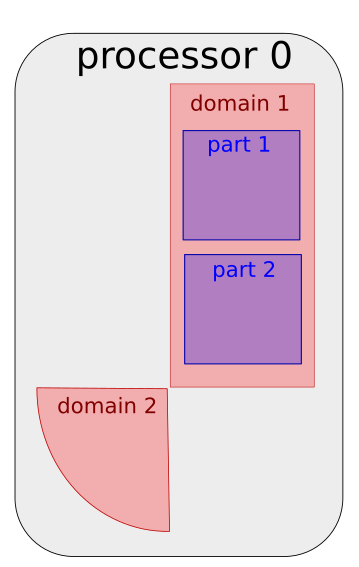

---
jupytext:
  text_representation:
    extension: '.md'
    format_name: myst
    format_version: '0.7'
    jupytext_version: 1.4.0+dev
kernelspec:
  display_name: Python 3
  language: python
  name: python3
---

# Exercise 1 : Mesh partitioning

It's time for some hands on experience with `ParaDiGM`!
Using the API referenced [here](https://numerics.gitlab-pages.onera.net/mesh/paradigm/dev_doc_pretty/user_manual/prepro_algo/index.html#python-api),
you will have fill in the code blocks to partition a mesh, i.e. to cut it in subdomains that will be mapped onto the processors of a parallel machine.
In the first section, we generate a block-distributed cube mesh for you. In the next section, you'll start running the partitioning algorithm.
After that, you will be able to retrieve you the arrays describing the partitionned mesh.

+++

*(Load custom magics)*

```{code-cell}
import os, sys
module_path = os.path.abspath(os.path.join('../../utils'))
if module_path not in sys.path:
    sys.path.append(module_path)
```

```{code-cell}
%reload_ext visu_magics
%reload_ext code_magics
```

+++

Due to Fortran language specificities, we start defining the variables needed for this exercise. All needed variables are defined.
If you think that there are too many or too little, try looking at the documentation again.

```{code-cell}
%%code_block -p exercise_1 -i 1

program pdm_t_mesh_partitioning_f

  use pdm
  use pdm_multipart
  use pdm_vtk
  use pdm_dcube_nodal_gen
  use pdm_dmesh_nodal
  use pdm_part_mesh_nodal
  use pdm_mesh_nodal
  use iso_c_binding
  use pdm_fortran

  implicit none

  include "mpif.h"

  !-----------------------------------------------------------
  integer (c_int)                       :: i

  ! MPI
  integer                               :: code
  integer                               :: i_rank
  integer                               :: n_rank
  integer, parameter                    :: comm = MPI_COMM_WORLD

  ! PDM_dcube_nodal_gen_create
  integer                               :: n_x, n_y, n_z
  integer                               :: elt_type, order
  double precision                      :: length
  double precision                      :: xmin, ymin, zmin
  type (c_ptr)                          :: dcube

  ! PDM_dcube_nodal_gen_dmesh_nodal_get
  type (c_ptr)                          :: dmn

  ! PDM_multipart_create
  type (c_ptr)                          :: mpart
  integer (c_int)                       :: n_zone = 1
  integer(kind=PDM_l_num_s), pointer    :: n_part(:) => null()
  integer (c_int)                       :: part_method, merge_zones
  double precision,          pointer    :: part_fraction(:) => null()

  integer (c_int)                       :: i_zone    = 0
  integer (c_int)                       :: i_section = 0
  integer (c_int)                       :: i_part    = 0

  ! PDM_multipart_set_reordering_options
  integer(kind=PDM_l_num_s), pointer    :: renum_cell_properties(:) => null()

  ! PDM_multipart_get_part_mesh_nodal
  type (c_ptr)                          :: pmn

  ! PDM_part_mesh_nodal_section_n_elt_get
  integer (c_int)                       :: n_elt = -1

  ! PDM_part_mesh_nodal_section_std_get
  integer(kind=PDM_l_num_s), pointer  :: elt_vtx(:)
  integer (pdm_g_num_s), pointer      :: elt_ln_to_gn(:)
  integer(kind=PDM_l_num_s), pointer  :: parent_num(:)
  integer (pdm_g_num_s), pointer      :: parent_entity_g_num(:)

  ! PDM_multipart_part_vtx_coord_get
  double precision, pointer           :: coords(:,:)
  integer(c_int)                      :: n_vtx = -1

  ! PDM_part_mesh_nodal_vtx_g_num_get
  integer (pdm_g_num_s), pointer      :: vtx_ln_to_gn(:)

  ! FV
  integer(kind=PDM_g_num_s), pointer :: edge_ln_to_gn(:)
  integer(c_int)                     :: n_edge
  integer(kind=PDM_l_num_s), pointer :: edge_vtx(:)
  integer(kind=PDM_l_num_s), pointer :: edge_vtx_idx(:)

  integer(kind=PDM_g_num_s), pointer :: face_ln_to_gn(:)
  integer(c_int)                     :: n_face
  integer(kind=PDM_l_num_s), pointer :: face_edge(:)
  integer(kind=PDM_l_num_s), pointer :: face_edge_idx(:)

  integer(kind=PDM_g_num_s), pointer :: cell_ln_to_gn(:)
  integer(c_int)                     :: n_cell
  integer(kind=PDM_l_num_s), pointer :: cell_face(:)
  integer(kind=PDM_l_num_s), pointer :: cell_face_idx(:)
  !-----------------------------------------------------------

```

## Generate the mesh

In this section, `ParaDiGM` tools are used to generate a simple mesh for this exercise: a cube made of tetrahedra.

```{code-cell}
%%code_block -p exercise_1 -i 2

  ! Initialize MPI environment
  call mpi_init(code)
  call mpi_comm_rank(comm, i_rank, code)
  call mpi_comm_size(comm, n_rank, code)

  ! Generate block-distributed parallelepided mesh
  n_x      = 10
  n_y      = 10
  n_z      = 10
  length   = 1.
  xmin     = 0.
  ymin     = 0.
  zmin     = 0.
  elt_type = PDM_MESH_NODAL_TETRA4
  order    = 1
  call PDM_dcube_nodal_gen_create(dcube,     &
                                  comm,      &
                                  n_x,       &
                                  n_y,       &
                                  n_z,       &
                                  length,    &
                                  xmin,      &
                                  ymin,      &
                                  zmin,      &
                                  elt_type,  &
                                  order,     &
                                  PDM_OWNERSHIP_USER)

  call PDM_dcube_nodal_gen_build(dcube, dmn)

  call PDM_dcube_nodal_gen_dmesh_nodal_get(dcube, dmn)

  call PDM_dmesh_nodal_generate_distribution(dmn)

  call PDM_dcube_nodal_gen_free(dcube)

```

Now that we have our mesh, let's partition it !

## Mesh partitioning

For mesh partitioning, as for all other `ParaDiGM` features, there are 5 main steps:
1. **create** the feature object
2. **set** the data necessary to operate with that feature
3. **compute**, operate the algorithm of the feature
4. **get**, retrieve the ouput of the algorithm
5. **free** the memory allocated to operate the feature

Following this logic, let's start **creating** (step 1) the mesh partitioning object for homogeneously balanced subdomains.

*Remark : since this is a basic example, we ask you to stick with the fixed values for n_zone, n_part, i_zone, i_part and merge_zones.
To get insight about the concepts behind those values you can have a look [here](#Annex 1)*

```{code-cell}
%%code_block -p exercise_1 -i 3

  ! Create partitioning object
  allocate(n_part(n_zone))

  do i = 1, n_zone
    n_part(i) = 1
  end do

  allocate(part_fraction(n_part(i_zone+1)))

  do i = 1, n_part(i_zone+1)
    part_fraction(i) = 1
  end do

  merge_zones = PDM_FALSE
  part_method = PDM_SPLIT_DUAL_WITH_HILBERT
  call PDM_multipart_create(mpart,                     & ! Mesh partitioning object
                            n_zone,                    & ! Number of zones
                            n_part,                    & ! Number of partitions per zone
                            merge_zones,               & ! PDM_FALSE (do not fuse zones)
                            part_method,               & ! Partitioning method
                            PDM_PART_SIZE_HOMOGENEOUS, & ! Subdomains are homogeneously balanced
                            part_fraction,             & ! Weight (in %) of each partition in heterogeneous case
                            comm,                      & ! MPI communicator
                            PDM_OWNERSHIP_KEEP)          ! Data ownership


```

Here, we chose to partition the cube with the Hilbert method. This method implemented in `ParaDiGM` does not ensure the subdomain to be connected.
This method is favored within the `ParaDiGM` algorithms since it provides quickly a good load balance. To ensure the partitions are connected use
`PDM_SPLIT_DUAL_WITH_PARMETIS` or `PDM_SPLIT_DUAL_WITH_PTSCOTCH` which call the external libraries ParMETIS and PT-Scotch.

After mapping the partitionned subdomains on the processors, it is interesting to renumber the entities
of the mesh on each processor for performance through cache blocking but it also provides interesting properties for the application.
You can here call the renumbering function but by telling it not to do any renumbering for a start.

```{code-cell}
%%code_block -p exercise_1 -i 4

  call PDM_multipart_set_reordering_options(mpart,                      &
                                            i_zone,                     &
                                            "PDM_PART_RENUM_CELL_NONE", &
                                            renum_cell_properties,      &
                                            "PDM_PART_RENUM_FACE_NONE")

```

Now that you have created a mesh partitioning object `mpart`, you can **set** (step 2) the cube mesh to it.

```{code-cell}
%%code_block -p exercise_1 -i 5

  call PDM_multipart_register_dmesh_nodal(mpart,  &
                                          i_zone, &
                                          dmn)

```

At this point you have provided all the information necessary to run the mesh partitioning algorithm. You can call the function to
**compute** (step 3) the subdomains that make up the partitionned cube.

```{code-cell}
%%code_block -p exercise_1 -i 6

  call PDM_multipart_run_ppart(mpart)
```

## Get the partitionned mesh

You can now **get** (step 4) the ouput mesh of the partitioning algorithm. Depending on the numerical method, the mesh has to be
described in a different way. For Finite-Element methods a nodal connectivity ([option 1](#Nodal connectivity (i.e. Finite-Element style)))) usually
suffices while for Finite-Volume methods all descending connectivities ([option 2](#Descending connectivity (i.e. Finite-Volume style))) are of interest.
Choose which one suits you best and go further in the exercise to the associated section.

### Nodal connectivity (i.e. Finite-Element style)

You choose to get the partitioned mesh in nodal connectivity, i.e. cell->vertex connectivity.

*Remark : The object in `ParaDiGM` in which partitionned nodal meshes are stored is `part_mesh_nodal`.
Here we get this object from `mpart` to directly have access to the arrays we are interested in.*

Let's start with the vertices composing the subdomain. How many vertices are there? What is their global number? What are their coordiantes?

```{code-cell}
%%code_block -p exercise_1 -i 7

  ! call PDM_multipart_part_vtx_coord_get(mpart,              &
  !                                       i_zone,             &
  !                                       i_part,             &
  !                                       coords,             &
  !                                       PDM_OWNERSHIP_USER, &
  !                                       n_vtx)


  ! call PDM_multipart_get_part_mesh_nodal(mpart,  &
  !                                        i_zone, &
  !                                        pmn,    &
  !                                        PDM_OWNERSHIP_USER)


  ! call PDM_part_mesh_nodal_vtx_g_num_get(pmn,    &
  !                                        i_part, &
  !                                        vtx_ln_to_gn)


```

Let's move on to the cells. How are the vertices connected to form cells? What is their global number? How many cells are there?

*Remark : since this is a basic example, we ask you to stick with the fixed value for i_section.
To get insight about the concept behind this value you can have a look [here](#Annex 1)*

```{code-cell}
%%code_block -p exercise_1 -i 8

  ! call PDM_part_mesh_nodal_section_n_elt_get(pmn,       &
  !                                            i_section, &
  !                                            i_part,    &
  !                                            n_elt)

  ! call PDM_part_mesh_nodal_section_std_get(pmn,                 &
  !                                          i_section,           &
  !                                          i_part,              &
  !                                          elt_vtx,             &
  !                                          elt_ln_to_gn,        &
  !                                          parent_num,          &
  !                                          parent_entity_g_num, &
  !                                          PDM_OWNERSHIP_KEEP)

  ! call PDM_part_mesh_nodal_free(pmn)

```

### Descending connectivity (i.e. Finite-Volume style)

You choose to get the partitioned mesh in descending connectivity, i.e. cell->face, face->edge and edge->vtx connectivities.

Let's start from the top with cell data. How many cells are there? What is their global number? Which faces compose the cells?

```{code-cell}
%%code_block -p exercise_1 -i 9

  call PDM_multipart_part_ln_to_gn_get(mpart,                &
                                       i_zone,               &
                                       i_part,               &
                                       PDM_MESH_ENTITY_CELL, &
                                       cell_ln_to_gn,        &
                                       PDM_OWNERSHIP_KEEP,   &
                                       n_cell)

  call PDM_multipart_part_connectivity_get(mpart,                           &
                                           i_zone,                          &
                                           i_part,                          &
                                           PDM_CONNECTIVITY_TYPE_CELL_FACE, &
                                           cell_face,                       &
                                           cell_face_idx,                   &
                                           PDM_OWNERSHIP_KEEP,              &
                                           n_cell)


```

For the faces we proceed in a similar way. How many faces are there? What is their global number? Which edges compose the faces?

```{code-cell}
%%code_block -p exercise_1 -i 10

  call PDM_multipart_part_ln_to_gn_get(mpart,                &
                                       i_zone,               &
                                       i_part,               &
                                       PDM_MESH_ENTITY_FACE, &
                                       face_ln_to_gn,        &
                                       PDM_OWNERSHIP_KEEP,   &
                                       n_face)

  call PDM_multipart_part_connectivity_get(mpart,                           &
                                           i_zone,                          &
                                           i_part,                          &
                                           PDM_CONNECTIVITY_TYPE_FACE_EDGE, &
                                           face_edge,                       &
                                           face_edge_idx,                   &
                                           PDM_OWNERSHIP_KEEP,              &
                                           n_face)

```

Let's do the same for edges. How many edges are there? What is their global number? Which vertices compose the edges?

*Remark : The edge->vertex connectivity index is not created in the `mpart` object since it is implicit. Indeed,
each edge is only composed of two vertices*

```{code-cell}
%%code_block -p exercise_1 -i 11

  call PDM_multipart_part_ln_to_gn_get(mpart,                &
                                       i_zone,               &
                                       i_part,               &
                                       PDM_MESH_ENTITY_EDGE, &
                                       edge_ln_to_gn,        &
                                       PDM_OWNERSHIP_KEEP,   &
                                       n_edge)

  call PDM_multipart_part_connectivity_get(mpart,                          &
                                           i_zone,                         &
                                           i_part,                         &
                                           PDM_CONNECTIVITY_TYPE_EDGE_VTX, &
                                           edge_vtx,                       &
                                           edge_vtx_idx,                   &
                                           PDM_OWNERSHIP_KEEP,             &
                                           n_edge)

```

To finish with, we need to have the description of the vertices.

```{code-cell}
%%code_block -p exercise_1 -i 12

  call PDM_multipart_part_ln_to_gn_get(mpart,                  &
                                       i_zone,                 &
                                       i_part,                 &
                                       PDM_MESH_ENTITY_VERTEX, &
                                       vtx_ln_to_gn,           &
                                       PDM_OWNERSHIP_KEEP,     &
                                       n_vtx)

  call PDM_multipart_part_vtx_coord_get(mpart,             &
                                       i_zone,             &
                                       i_part,             &
                                       coords,             &
                                       PDM_OWNERSHIP_KEEP, &
                                       n_vtx)

```

Once the partitionned mesh retrieved we can **free** (step 5) the memory allocated for and by the partitioning algorithm.

```{code-cell}
%%code_block -p exercise_1 -i 13

  ! free
  deallocate(n_part, &
             part_fraction)
  call PDM_DMesh_nodal_free(dmn)
  call PDM_multipart_free(mpart)

  ! Finalize MPI environment
  call mpi_finalize(code)

  if (i_rank == 0) then
    print *, "End :)"
  endif

end program pdm_t_mesh_partitioning_f

```

## Execution and visualization

Run the following cells to execute to program you just wrote and visualize the partitionned output mesh.

```{code-cell}
%merge_code_blocks -l fortran -p exercise_1 -n 2 -v -c
```

```{code-cell}
%%visualize
visu/PMESH.case : i_part
```

## Annex 1

In certain settings, the mesh is an assembly of several sub-meshes. These are called *zones*.


Each zone *zone* is partitionned in subdomains which
are mapped to the processors of the parallel machine. On a processor the subdomain (of a mesh or a zone) can be sudivided in *parts*.



A mesh can be composed of several element types (tetrahedra, hexahedra, prisms...). In certain settings, the mesh definition for each specific element type
is stored in a seperate *section*. So in a *section* one will find data for a specific element type.


