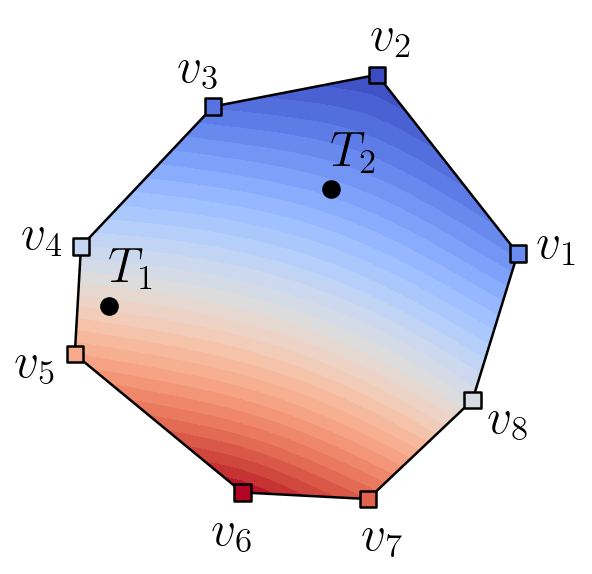

---
jupytext:
  text_representation:
    extension: '.md'
    format_name: myst
    format_version: '0.7'
    jupytext_version: 1.4.0+dev
kernelspec:
  display_name: Python 3
  language: python
  name: python3
---

+++ {"editable": false, "deletable": false}

# Exercise 2 : Localization of a point cloud inside a mesh

+++ {"editable": false, "deletable": false}

In this second exercise we will focus on the **Mesh Location** feature.
It consists in computing the location of one or more partitioned point clouds (referred to as the *targets*) inside a partitioned mesh (referred to as the *source*).

A mapping between the source mesh elements and the target points they contain is computed, which consists in
  - geometric data (distances, barycentric and parametric coordinates, ...) ;
  - an MPI communication graph as the associated entities are, in general, distributed on different processes.

This mapping is typically used for interpolating data from the source mesh to the point clouds in applications such as the coupling between non-matching grids.


The aim of this exercise is to perform such an interpolation.
The exercise is structured in two parts:
1. Compute the location
2. Perform the interpolation

Your task is to fill in the empty code cells using the API referenced [here](https://numerics.gitlab-pages.onera.net/mesh/paradigm/dev_formation/user_manual/prepro_algo/mesh_location.html#fortran-api).

*Note: For easier visualization, we will study a two-dimensional case but the feature is also available in three dimensions.*

+++ {"editable": false, "deletable": false}

## Load magic commands
As usual we start by loading the custom magic commands.

```{code-cell} ipython3
---
"editable": false
"deletable": false
---
import os, sys
module_path = os.path.abspath(os.path.join('../../utils'))
if module_path not in sys.path:
    sys.path.append(module_path)
```

```{code-cell}
---
"editable": false
"deletable": false
---
%reload_ext visu_magics
%reload_ext code_magics
```

+++ {"editable": false, "deletable": false}

## Use required modules

To begin, we import the required modules.

```{code-cell}
---
"editable": false
"deletable": false
---
%%code_block -p exercise_2 -i 1
#include "pdm_configf.h"

program exercise_2

  use pdm
  use pdm_pointer_array
  use pdm_generate_mesh
  use pdm_mesh_location
  use pdm_part_to_part
  use iso_c_binding
  use pdm_writer_wrapper

  implicit none

  include "mpif.h"

```

+++ {"editable": false, "deletable": false}

## Initialize MPI

```{code-cell}
---
"deletable": false
---
%%code_block -p exercise_2 -i 2

  ! Variables for MPI
  integer                            :: comm = MPI_COMM_WORLD
  integer                            :: i_rank, ierr

```

```{code-cell}
---
"deletable": false
---
%%code_block -p exercise_2 -i 100

  ! Initialize MPI
  call mpi_init(ierr)
  call mpi_comm_rank(comm, i_rank, ierr)
```

+++ {"editable": false, "deletable": false}

## 1. Localization


### Generate a partitioned "source" mesh

We start by generating the partitioned source mesh.

By now you should be capable of partitioning a mesh using **ParaDiGM** (if not, you should definitely take a look at [**Exercise 1**](../02_Exercise_1/exercise_1.ipynb)).
To gain some time, let's use the [*PDM_generate_mesh*](https://numerics.gitlab-pages.onera.net/mesh/paradigm/dev_formation/user_manual/simple_mesh_gen/generate_mesh.html#fortran-api) service to generate a partitioned mesh in a single function call.

Here we generate a square mesh composed of polygonal elements.

*Nothing to do here, you can move on. Just don't forget to run the cells!*

```{code-cell}
---
"deletable": false
---
%%code_block -p exercise_2 -i 3

  ! Variables for generation of source mesh
  integer(pdm_g_num_s)               :: src_n_vtx_seg = 10    ! number of vertices along each side of the square
  integer(pdm_l_num_s)               :: src_n_part    = 1     ! number of partitions per MPI rank
  double precision                   :: src_random    = 0.8d0 ! randomization factor

  integer(pdm_l_num_s),      pointer :: src_n_vtx(:)      => null()
  integer(pdm_l_num_s),      pointer :: src_n_edge(:)     => null()
  integer(pdm_l_num_s),      pointer :: src_n_face(:)     => null()
  type(PDM_pointer_array_t), pointer :: src_vtx_coord     => null()
  type(PDM_pointer_array_t), pointer :: src_edge_vtx      => null()
  type(PDM_pointer_array_t), pointer :: src_face_edge_idx => null()
  type(PDM_pointer_array_t), pointer :: src_face_edge     => null()
  type(PDM_pointer_array_t), pointer :: src_face_vtx      => null()
  type(PDM_pointer_array_t), pointer :: src_vtx_ln_to_gn  => null()
  type(PDM_pointer_array_t), pointer :: src_edge_ln_to_gn => null()
  type(PDM_pointer_array_t), pointer :: src_face_ln_to_gn => null()

```

```{code-cell}
---
"deletable": false
---
%%code_block -p exercise_2 -i 101

  ! Generate partitioned source mesh
  call pdm_generate_mesh_rectangle_ngon(comm,                         &
                                        PDM_MESH_NODAL_POLY_2D,       &
                                        0.d0,                         &
                                        0.d0,                         &
                                        0.d0,                         &
                                        1.d0,                         &
                                        1.d0,                         &
                                        src_n_vtx_seg,                &
                                        src_n_vtx_seg,                &
                                        src_n_part,                   &
                                        PDM_SPLIT_DUAL_WITH_PARMETIS, &
                                        src_n_vtx,                    &
                                        src_n_edge,                   &
                                        src_n_face,                   &
                                        src_vtx_coord,                &
                                        src_edge_vtx,                 &
                                        src_face_edge_idx,            &
                                        src_face_edge,                &
                                        src_face_vtx,                 &
                                        src_vtx_ln_to_gn,             &
                                        src_edge_ln_to_gn,            &
                                        src_face_ln_to_gn,            &
                                        random_factor_opt=src_random)

```


+++ {"editable": false, "deletable": false}

### Generate a partitioned "target" mesh

We then generate a second partitioned mesh.
We will use its vertices as a target point cloud.
This second mesh is deliberately offset so that some target points lie outside the source mesh.
These points may not be located.
We will see later how to deal with these *unlocated* points.

*Note: we use a different partitioning method for the two meshes so that the source and target partitions do not match.*

*Nothing to do here either. However, once you've successfully completed the localization procedure, feel free to play with the parameters of the two meshes.*

```{code-cell}
---
"deletable": false
---
%%code_block -p exercise_2 -i 4

  ! Variables for generation of target mesh
  integer(pdm_g_num_s)               :: tgt_n_vtx_seg = 8     ! number of vertices along each side of the square
  integer(pdm_l_num_s)               :: tgt_n_part    = 1     ! number of partitions per MPI rank
  double precision                   :: tgt_xmin      = 0.3d0 ! x-offset
  double precision                   :: tgt_ymin      = 0.3d0 ! y-offset
  double precision                   :: tgt_random    = 0.0d0 ! randomization factor

  integer(pdm_l_num_s),      pointer :: tgt_n_vtx(:)      => null()
  integer(pdm_l_num_s),      pointer :: tgt_n_edge(:)     => null()
  integer(pdm_l_num_s),      pointer :: tgt_n_face(:)     => null()
  type(PDM_pointer_array_t), pointer :: tgt_vtx_coord     => null()
  type(PDM_pointer_array_t), pointer :: tgt_edge_vtx      => null()
  type(PDM_pointer_array_t), pointer :: tgt_face_edge_idx => null()
  type(PDM_pointer_array_t), pointer :: tgt_face_edge     => null()
  type(PDM_pointer_array_t), pointer :: tgt_face_vtx      => null()
  type(PDM_pointer_array_t), pointer :: tgt_vtx_ln_to_gn  => null()
  type(PDM_pointer_array_t), pointer :: tgt_edge_ln_to_gn => null()
  type(PDM_pointer_array_t), pointer :: tgt_face_ln_to_gn => null()

```

```{code-cell}
---
"deletable": false
---
%%code_block -p exercise_2 -i 102

  ! Generate partitioned target mesh
  call pdm_generate_mesh_rectangle_ngon(comm,                        &
                                        PDM_MESH_NODAL_QUAD4,        &
                                        tgt_xmin,                    &
                                        tgt_ymin,                    &
                                        0.d0,                        &
                                        1.d0,                        &
                                        1.d0,                        &
                                        tgt_n_vtx_seg,               &
                                        tgt_n_vtx_seg,               &
                                        tgt_n_part,                  &
                                        PDM_SPLIT_DUAL_WITH_HILBERT, &
                                        tgt_n_vtx,                   &
                                        tgt_n_edge,                  &
                                        tgt_n_face,                  &
                                        tgt_vtx_coord,               &
                                        tgt_edge_vtx,                &
                                        tgt_face_edge_idx,           &
                                        tgt_face_edge,               &
                                        tgt_face_vtx,                &
                                        tgt_vtx_ln_to_gn,            &
                                        tgt_edge_ln_to_gn,           &
                                        tgt_face_ln_to_gn,           &
                                        random_factor_opt=tgt_random)

```


+++ {"editable": false, "deletable": false}

### Create the Mesh Location structure

Now that we have all the required inputs, let's create an instance of the Mesh Location structure.

```{code-cell}
---
"deletable": false
---
%%code_block -p exercise_2 -i 5

  ! Variables for Mesh Location
  type(c_ptr)                        :: mesh_loc = C_NULL_PTR

```

```{code-cell}
---
"deletable": false
---
%%code_block -p exercise_2 -i 103

  ! Create the Mesh Location structure
  ! EXO
  call pdm_mesh_location_create(mesh_loc, &
                                1,        &
                                comm,     &
                                PDM_OWNERSHIP_KEEP)

```

+++ {"editable": false, "deletable": false}

### Set the target point cloud

Now let's provide the target point cloud to the structure.
Recall that there can be more than one partition per MPI rank.

```{code-cell}
---
"deletable": false
---
%%code_block -p exercise_2 -i 6

  ! Variables for setting the target point cloud
  integer(pdm_g_num_s),      pointer :: vtx_ln_to_gn(:)  => null()
  double precision,          pointer :: vtx_coord(:,:)   => null()
  integer                            :: i_part

```

```{code-cell}
---
"deletable": false
---
%%code_block -p exercise_2 -i 104

  ! Set target point cloud
  ! EXO
  call pdm_mesh_location_n_part_cloud_set(mesh_loc, &
                                          0,        &
                                          tgt_n_part)

  do i_part = 1, tgt_n_part
    call pdm_pointer_array_part_get(tgt_vtx_ln_to_gn, &
                                    i_part-1,         &
                                    vtx_ln_to_gn)

    call pdm_pointer_array_part_get(tgt_vtx_coord,             &
                                    i_part-1,                  &
                                    PDM_STRIDE_CST_INTERLACED, &
                                    3,                         &
                                    vtx_coord)

    call pdm_mesh_location_cloud_set(mesh_loc,          &
                                     0,                 &
                                     i_part-1,          &
                                     tgt_n_vtx(i_part), &
                                     vtx_coord,         &
                                     vtx_ln_to_gn)
  enddo

```


+++ {"editable": false, "deletable": false}

### Set the source mesh

Now let's provide the source mesh to the structure.

Here you have essentially two options:
- you can either define the mesh with "nodal" connectivity (i.e. Finite-Element style)
- or with "descending" connectivity (i.e. Finite-Volume style)

Choose the one that suits you best, and again, recall that there can be more than one partition per MPI rank.

```{code-cell}
---
"deletable": false
---
%%code_block -p exercise_2 -i 7

  ! Variables for setting the source mesh
  logical                            :: nodal            = .false.
  integer(pdm_g_num_s),      pointer :: face_ln_to_gn(:) => null()
  integer(pdm_l_num_s),      pointer :: face_edge_idx(:) => null()
  integer(pdm_l_num_s),      pointer :: face_edge(:)     => null()
  integer(pdm_l_num_s),      pointer :: face_vtx(:)      => null()
  integer(pdm_l_num_s),      pointer :: edge_vtx(:)      => null()

```

```{code-cell}
---
"deletable": false
---
%%code_block -p exercise_2 -i 105

  ! Set source mesh
  ! EXO
  call pdm_mesh_location_mesh_n_part_set(mesh_loc, src_n_part)

  do i_part = 1, src_n_part

    call pdm_pointer_array_part_get(src_vtx_ln_to_gn, &
                                    i_part-1,         &
                                    vtx_ln_to_gn)

    call pdm_pointer_array_part_get(src_vtx_coord,             &
                                    i_part-1,                  &
                                    PDM_STRIDE_CST_INTERLACED, &
                                    3,                         &
                                    vtx_coord)


    call pdm_pointer_array_part_get(src_face_ln_to_gn, &
                                    i_part-1,          &
                                    face_ln_to_gn)

    call pdm_pointer_array_part_get(src_face_edge_idx, &
                                    i_part-1,          &
                                    face_edge_idx)


    if (nodal) then
      call pdm_pointer_array_part_get(src_face_vtx, &
                                      i_part-1,     &
                                      face_vtx)

      call pdm_mesh_location_nodal_part_set_2d(mesh_loc,           &
                                               i_part-1,           &
                                               src_n_face(i_part), &
                                               face_edge_idx,      &
                                               face_vtx,           &
                                               face_ln_to_gn,      &
                                               src_n_vtx(i_part),  &
                                               vtx_coord,          &
                                               vtx_ln_to_gn)
    else
      call pdm_pointer_array_part_get(src_face_edge, &
                                      i_part-1,      &
                                      face_edge)

      call pdm_pointer_array_part_get(src_edge_vtx, &
                                      i_part-1,     &
                                      edge_vtx)

      call pdm_mesh_location_part_set_2d(mesh_loc,           &
                                         i_part-1,           &
                                         src_n_face(i_part), &
                                         face_edge_idx,      &
                                         face_edge,           &
                                         face_ln_to_gn,      &
                                         src_n_edge(i_part), &
                                         edge_vtx,           &
                                         src_n_vtx(i_part),  &
                                         vtx_coord,          &
                                         vtx_ln_to_gn)

    endif
  enddo

```


+++ {"editable": false, "deletable": false}

### Set some optional parameters

The location algorithm uses a preconditioning stage which consists in associating candidate elements and points before computed the exact location.
Three preconditioning methods are available:
- `PDM_MESH_LOCATION_OCTREE`
- `PDM_MESH_LOCATION_DBBTREE`
- `PDM_MESH_LOCATION_LOCATE_ALL_TGT`

The first two methods use bounding boxes and distributed tree data structures to find the candidate pairs efficiently.
Theses boxes can be expanded using a **relative geometric tolerance** allowing for safer candidate detection.
The third method uses a combination of both trees to ensure all target points are "located", i.e. associated to the nearest source element.

(By default, the `PDM_MESH_LOCATION_OCTREE` method is used, with a relative tolerance equal to zero.)

We recommend that you first go through the entire localization procedure before worrying about these options.
You will still have time afterwards to play with them and see the impact they can have.

```{code-cell}
---
"deletable": false
---
%%code_block -p exercise_2 -i 106

  ! Set the location preconditioning method (optional)
  ! EXO
  call pdm_mesh_location_method_set(mesh_loc, PDM_MESH_LOCATION_OCTREE)

  ! Set the geometric tolerance (optional)
  ! EXO
  call pdm_mesh_location_tolerance_set(mesh_loc, 1.d-6)

```


+++ {"editable": false, "deletable": false}

### Compute the localization

Now that everything is ready, we can compute the localization.
Once the calculation is complete, we can display the elapsed and CPU times.

```{code-cell}
---
"deletable": false
---
%%code_block -p exercise_2 -i 107

  ! Compute location
  ! EXO
  call pdm_mesh_location_compute(mesh_loc)

  ! Dump elapsed and CPU times
  ! EXO
  call pdm_mesh_location_dump_times(mesh_loc)

```


+++ {"editable": false, "deletable": false}

## 2. Interpolation

Now that the localization has been computed, the mesh location structure stores the mapping between the source mesh elements and the target points.
This mapping consists in:
- a set of geometric data sufficient for P1 interpolation of node-based fields ;
- an MPI communication graph to exchange data between the mapped entities.

In the second part of this exercise you will have to use these two pieces of information to:
1. exchange the global ids of the source elements to the corresponding target points: this way each *located* point is supposed to receive the global id of the element it is contained in ;
2. interpolate (and exchange) a node-based field: we choose a linear field such as the Cartesian coordinate *x* so we can easily check everything went right.


+++ {"editable": false, "deletable": false}

### Retrieve the Part-to-part instance

The communication graph is embodied in the form of a [Part-to-part](https://numerics.gitlab-pages.onera.net/mesh/paradigm/dev_formation/user_manual/comm_graph/ptp.html#fortran-api) instance.

The Part-to-part feature has been created to exchange data between two entities partitions.
That is why the Part-to-part structure is built by specifying the partitions on both sides, as well as the graph of the links between elements of partition 1 (*Part1*) to partition 2 (*Part2*).


On the figure above the first partition is represented by the red set of points and the second partition by the blue set of points.
The graph between *Part1* and *Part2* is symbolised by the gray arrows.

In this case, *Part1* represents the source mesh and *Part2* the target point cloud.

The Part-to-part instance was built during the localization computation and can be accessed from the Mesh Location structure.

```{code-cell}
---
"deletable": false
---
%%code_block -p exercise_2 -i 8

  ! Variables for retrieving the Part-to-part instance
  type(c_ptr)                        :: ptp = C_NULL_PTR

```

```{code-cell}
---
"deletable": false
---
%%code_block -p exercise_2 -i 108

  ! Get Part-to-part structure
  call pdm_mesh_location_part_to_part_get(mesh_loc, &
                                          0,        &
                                          ptp,      &
                                          PDM_OWNERSHIP_USER)

```


+++ {"editable": false, "deletable": false}

Part-to-part is able to perform non-blocking exchanges so here's how we're going to proceed:
1. initiate the first exchange: each source element sends its global id to all the target points it contains ;
2. overlap this communication by the computation of the interpolated *x* on the source side ;
3. initiate the second exchange ;
4. finalize both exchanges.

### First exchange

Here you need to initiate the exchange of global ids from the source mesh elements to the target points.

##### **<span style="color:olivedrab;">Analogy</span>**
*<span style="color:olivedrab;">
Marie is part of the Dupont family. She is going to meet members of the Perez family. She already knows some of them.
Marie is going to provide her name to the members of the Perez family she doesn't know.
In a sense, we can link Marie with the members of the Perez family she doesn't know. Then communicate to them the same information,
which is her name. This is exactly a Part-to-part exchange with the option `PDM_PART_TO_PART_DATA_DEF_ORDER_PART1`.
In our mesh location exercise, who is the Dupont family who will provide their name and who is the Perez family?
</span>*

As each MPI ranks hosts source *and* target partitions, we will use the **pdm_part_to_part_iexch** subroutine which allows for transparent, bilateral data exchange.

+++ {"jupyter": {"source_hidden": true}, "editable": false, "deletable": false}

Hints:
  - each cell sends a **single** value (its **global id**)
  - the **same** value is sent to each corresponding target

```{code-cell}
---
"deletable": false
---
%%code_block -p exercise_2 -i 9

  ! Variables for first exchange
  integer(pdm_l_num_s)               :: request1
  type(PDM_pointer_array_t), pointer :: tgt_recv_field1  => null()

```

```{code-cell}
---
"deletable": false
---
%%code_block -p exercise_2 -i 109

  ! Initiate exchange of first field
  ! EXO
  request1 = -1
  call pdm_part_to_part_iexch(ptp,                                   &
                              PDM_MPI_COMM_KIND_P2P,                 &
                              PDM_STRIDE_CST_INTERLACED,             & ! ?
                              PDM_PART_TO_PART_DATA_DEF_ORDER_PART1, & ! ?
                              1,                                     & ! ?
                              null(),                                & ! ?
                              src_face_ln_to_gn,                     & ! ?
                              null(),                                & ! ?
                              tgt_recv_field1,                       & ! ?
                              request1)                                ! ?

```


+++ {"editable": false, "deletable": false}

### Interpolate the second field

Here you need to interpolate the node-based field from the source mesh onto the target points.
That means for each target point computing the weighted average of the field on the vertices of the element it is located in.



Each color on the picture above represents the weight associated to the red point in this pentagon.

*Will the weighted average be the same for the red and blue point?*

This means there is a better side to do the interpolation computation.
Depending at the side of which part (*Part1* or *Part2*) the computation is done more data will be exchanged.

*What is the most efficient side in terms of amount of data to exchange to do the computation?*

Doing the interpolation on *Part1* (the source side), you will send one value to the target point in *Part 2* : the interpolated field.
Doing the interpolation on *Part2* (the target side), you will send to each target point the coordinates and the field at each vertex of the element of the source mesh it has been located in.

You will implement the first option. You can start doing the interpolation.

*What is the data you have access to?*

You are on the side of *Part1* (source mesh). You have access to the elements of the mesh, the face->vertex connectivity and for each
face the points located in it.

*Knowing this, how will you set up the loops over the entities to compute the interpolation?*

```{code-cell}
---
"deletable": false
---
%%code_block -p exercise_2 -i 10

  ! Variables for interpolation of second field
  type(PDM_pointer_array_t), pointer :: src_send_field2              => null()
  double precision,          pointer :: field_d(:)                   => null()
  integer                            :: n_pts, elt_n_vtx, i_elt, i_pt, i_vtx, vtx_id
  integer(pdm_l_num_s),      pointer :: src_to_tgt_idx(:)            => null()
  integer(pdm_g_num_s),      pointer :: points_gnum(:)               => null()
  double precision,          pointer :: points_coords(:,:)           => null()
  double precision,          pointer :: points_uvw(:,:)              => null()
  integer(pdm_l_num_s),      pointer :: points_weights_idx(:)        => null()
  double precision,          pointer :: points_weights(:)            => null()
  double precision,          pointer :: points_dist2(:)              => null()
  double precision,          pointer :: points_projected_coords(:,:) => null()
  integer(pdm_l_num_s),      pointer :: cell_vtx_idx(:)              => null()
  integer(pdm_l_num_s),      pointer :: cell_vtx(:)                  => null()

```

```{code-cell}
---
"deletable": false
---
%%code_block -p exercise_2 -i 110

  ! Interpolate second field (node-based)
  call pdm_pointer_array_create(src_send_field2, &
                                src_n_part,      &
                                PDM_TYPE_DOUBLE)
  ! EXO
  do i_part = 1, src_n_part

    call pdm_mesh_location_points_in_elt_get(mesh_loc,           &
                                             0,                  &
                                             i_part-1,           &
                                             src_to_tgt_idx,     &
                                             points_gnum,        &
                                             points_coords,      &
                                             points_uvw,         &
                                             points_weights_idx, &
                                             points_weights,     &
                                             points_dist2,       &
                                             points_projected_coords)

    call pdm_pointer_array_part_get(src_vtx_coord,             &
                                    i_part-1,                  &
                                    PDM_STRIDE_CST_INTERLACED, &
                                    3,                         &
                                    vtx_coord)

    call pdm_mesh_location_cell_vertex_get(mesh_loc,     &
                                           i_part-1,     &
                                           cell_vtx_idx, &
                                           cell_vtx)

    n_pts = src_to_tgt_idx(src_n_face(i_part)+1)

    allocate(field_d(n_pts))
    do i_elt = 1, src_n_face(i_part)
      do i_pt = src_to_tgt_idx(i_elt)+1, src_to_tgt_idx(i_elt+1)
        field_d(i_pt) = 0.d0

        elt_n_vtx = cell_vtx_idx(i_elt+1) - cell_vtx_idx(i_elt)

        if (points_weights_idx(i_pt+1) - points_weights_idx(i_pt) /= elt_n_vtx) then
          print *, "Error elt_n_vtx"
          stop
        endif

        do i_vtx = 1, elt_n_vtx
          vtx_id = cell_vtx(cell_vtx_idx(i_elt) + i_vtx)
          field_d(i_pt) = field_d(i_pt) + vtx_coord(1,vtx_id) * points_weights(points_weights_idx(i_pt) + i_vtx)
        enddo

      enddo
    enddo

    call pdm_pointer_array_part_set(src_send_field2, &
                                    i_part-1,        &
                                    field_d)
  enddo

```


+++ {"editable": false, "deletable": false}

### Exchange the second interpolated field

Now that you've done the interpolation, it is time to send the interpolated field to the target points.

##### **<span style="color:olivedrab;">Analogy</span>**
*<span style="color:olivedrab;">
Marie met the grandparents of the Perez family : Marta & Luis and Julio & Paula. She wants to send them a Christmas postcard.
She chose a card with a Christmas tree for Marta & Luis and a card with Santa for Julio & Paula.
In a sens, we can link Marie to Marta & Luis and Julio & Paula. This time she won't provide the same information to both of them.
This is exactly a Part-to-part exchange with the option `PDM_PART_TO_PART_DATA_DEF_ORDER_PART1_TO_PART2`.
What does the postcard represent in our location exercise?
</span>*

You can now initiate the exchange of the interpolated field you just computed.

```{code-cell}
---
"deletable": false
---
%%code_block -p exercise_2 -i 11

  ! Variables for second exchange
  integer(pdm_l_num_s)               :: request2
  type(PDM_pointer_array_t), pointer :: tgt_recv_field2  => null()

```

```{code-cell}
---
"deletable": false
---
%%code_block -p exercise_2 -i 111

  ! Initiate exchange of second field
  request2 = -1
  call pdm_part_to_part_iexch(ptp,                                            &
                              PDM_MPI_COMM_KIND_P2P,                          &
                              PDM_STRIDE_CST_INTERLACED,                      & ! ?
                              PDM_PART_TO_PART_DATA_DEF_ORDER_PART1_TO_PART2, & ! ?
                              1,                                              & ! ?
                              null(),                                         & ! ?
                              src_send_field2,                                & ! ?
                              null(),                                         & ! ?
                              tgt_recv_field2,                                & ! ?
                              request2)                                         ! ?

```


+++ {"editable": false, "deletable": false}

### Check the interpolated field received on the target side

Finally, we can finalize both exchanges, check and visualize the received fields on the target side.

#### *Watch out for unlocated points!*
Notice that you only received information relative to the *located* points.
You must therefore use the appropriate indirection to correctly read the received arrays.


```{code-cell}
---
"deletable": false
---
%%code_block -p exercise_2 -i 12

  ! Variables for final check and visualization
  integer                            :: n_located
  integer(pdm_l_num_s),      pointer :: located(:)   => null()
  integer                            :: n_unlocated
  integer(pdm_l_num_s),      pointer :: unlocated(:) => null()

  double precision                   :: error
  integer(pdm_g_num_s),      pointer :: field_i(:)   => null()
  type(my_field_t)                   :: src_visu_field1(1)
  type(my_field_t)                   :: src_visu_field2(1)
  type(my_field_t)                   :: tgt_visu_fields(3)
  double precision,          pointer :: visu_field1(:)        => null()
  double precision,          pointer :: visu_field2(:)        => null()
  double precision,          pointer :: visu_field3(:)        => null()
  integer                            :: i

```

```{code-cell}
---
"deletable": false
---
%%code_block -p exercise_2 -i 112

  ! Finalize both exchanges
  call pdm_part_to_part_iexch_wait(ptp, request1)
  call pdm_part_to_part_iexch_wait(ptp, request2)

  ! Prepare for visualization
  do i = 1, 3
    call pdm_pointer_array_create(tgt_visu_fields(i)%pa, &
                                  tgt_n_part,            &
                                  PDM_TYPE_DOUBLE)
  enddo
  tgt_visu_fields(1)%name = "field1"
  tgt_visu_fields(2)%name = "field2"
  tgt_visu_fields(3)%name = "is_located"

  ! Check received fields
  do i_part = 1, tgt_n_part

    allocate(visu_field1(tgt_n_vtx(i_part)), &
             visu_field2(tgt_n_vtx(i_part)), &
             visu_field3(tgt_n_vtx(i_part)))

    ! EXO
    n_located = pdm_mesh_location_n_located_get(mesh_loc, &
                                                0,        &
                                                i_part-1)

    call pdm_mesh_location_located_get(mesh_loc, &
                                       0,        &
                                       i_part-1, &
                                       located)

    n_unlocated = pdm_mesh_location_n_unlocated_get(mesh_loc, &
                                                    0,        &
                                                    i_part-1)

    call pdm_mesh_location_unlocated_get(mesh_loc, &
                                         0,        &
                                         i_part-1, &
                                         unlocated)

    call pdm_pointer_array_part_get(tgt_vtx_ln_to_gn, &
                                    i_part-1,         &
                                    vtx_ln_to_gn)

    call pdm_pointer_array_part_get(tgt_vtx_coord,             &
                                    i_part-1,                  &
                                    PDM_STRIDE_CST_INTERLACED, &
                                    3,                         &
                                    vtx_coord)

    call pdm_pointer_array_part_get(tgt_recv_field1, &
                                    i_part-1,        &
                                    field_i)

    call pdm_pointer_array_part_get(tgt_recv_field2, &
                                    i_part-1,        &
                                    field_d)

    do i = 1, n_unlocated
      vtx_id = unlocated(i)
      visu_field1(vtx_id) = -1.d0
      visu_field2(vtx_id) = -1.d0
      visu_field3(vtx_id) =  0.d0
    enddo

    do i = 1, n_located
      vtx_id = located(i)
      error  = abs(field_d(i) - vtx_coord(1,vtx_id))
      if (error > 1.e-9) then
        print *, "!! error vtx", vtx_ln_to_gn(vtx_id), " :", error
      endif

      visu_field1(vtx_id) = field_i(i)
      visu_field2(vtx_id) = field_d(i)
      visu_field3(vtx_id) = 1.d0

      call pdm_pointer_array_part_set(tgt_visu_fields(1)%pa, &
                                      i_part-1,              &
                                      visu_field1)

      call pdm_pointer_array_part_set(tgt_visu_fields(2)%pa, &
                                      i_part-1,              &
                                      visu_field2)

      call pdm_pointer_array_part_set(tgt_visu_fields(3)%pa, &
                                      i_part-1,              &
                                      visu_field3)

    enddo

  enddo
```


+++ {"editable": false, "deletable": false}

*Write output files for visualization, nothing to do here.*

```{code-cell}
---
"deletable": false
---
%%code_block -p exercise_2 -i 113
  ! Export for visualization, nothing to do here
  call pdm_pointer_array_create(src_visu_field1(1)%pa, &
                                src_n_part,            &
                                PDM_TYPE_DOUBLE)
  call pdm_pointer_array_create(src_visu_field2(1)%pa, &
                                src_n_part,            &
                                PDM_TYPE_DOUBLE)

  src_visu_field1(1)%name = "field1"
  src_visu_field2(1)%name = "field2"

  do i_part = 1, src_n_part
  call pdm_pointer_array_part_get(src_face_ln_to_gn, &
                                  i_part-1,          &
                                  face_ln_to_gn)
    allocate(field_d(src_n_face(i_part)))
    field_d(1:src_n_face(i_part)) = face_ln_to_gn(1:src_n_face(i_part))
    call pdm_pointer_array_part_set(src_visu_field1(1)%pa, &
                                    i_part-1,              &
                                    field_d)

    call pdm_pointer_array_part_get(src_vtx_coord,             &
                                    i_part-1,                  &
                                    PDM_STRIDE_CST_INTERLACED, &
                                    3,                         &
                                    vtx_coord)
    allocate(field_d(src_n_vtx(i_part)))
    field_d(1:src_n_vtx(i_part)) = vtx_coord(1,1:src_n_vtx(i_part))
    call pdm_pointer_array_part_set(src_visu_field2(1)%pa, &
                                    i_part-1,              &
                                    field_d)
  enddo

  call writer_wrapper(comm,                      &
                      "visu",                    &
                      "src_mesh",                &
                      src_n_part,                &
                      src_n_vtx,                 &
                      src_vtx_coord,             &
                      src_vtx_ln_to_gn,          &
                      src_n_face,                &
                      src_face_edge_idx,         &
                      src_face_vtx,              &
                      src_face_ln_to_gn,         &
                      elt_field=src_visu_field1, &
                      vtx_field=src_visu_field2)

  call writer_wrapper(comm,                  &
                      "visu",                &
                      "tgt_mesh",            &
                      tgt_n_part,            &
                      tgt_n_vtx,             &
                      tgt_vtx_coord,         &
                      tgt_vtx_ln_to_gn,      &
                      tgt_n_face,            &
                      tgt_face_edge_idx,     &
                      tgt_face_vtx,          &
                      tgt_face_ln_to_gn,     &
                      vtx_field=tgt_visu_fields)

```


+++ {"editable": false, "deletable": false}

### Free memory

Congratulations! You've made it to the end of the exercise :)
Now let's clean the mess we just made and free the allocated memory.

```{code-cell}
---
"deletable": false
---
%%code_block -p exercise_2 -i 114

  ! Free memory
  call pdm_mesh_location_free(mesh_loc)

  call pdm_part_to_part_free(ptp)

```


+++ {"editable": false, "deletable": false}

### Finalize

Finalize MPI.

```{code-cell}
---
"deletable": false
---
%%code_block -p exercise_2 -i 115

  if (i_rank == 0) then
    print *, "The End :D"
  endif

  call mpi_finalize(ierr)

end program exercise_2
```

+++ {"editable": false, "deletable": false}

## Compile the code and run

Moment of truth!

```{code-cell}
---
"deletable": false
---
%merge_code_blocks -l fortran -p exercise_2 -n 2
```

+++ {"editable": false, "deletable": false}

## Visualize the results

```{code-cell}
---
"deletable": false
---
%%visualize -nl -sv
visu/SRC_MESH.case
visu/TGT_MESH.case : is_located : points
```
