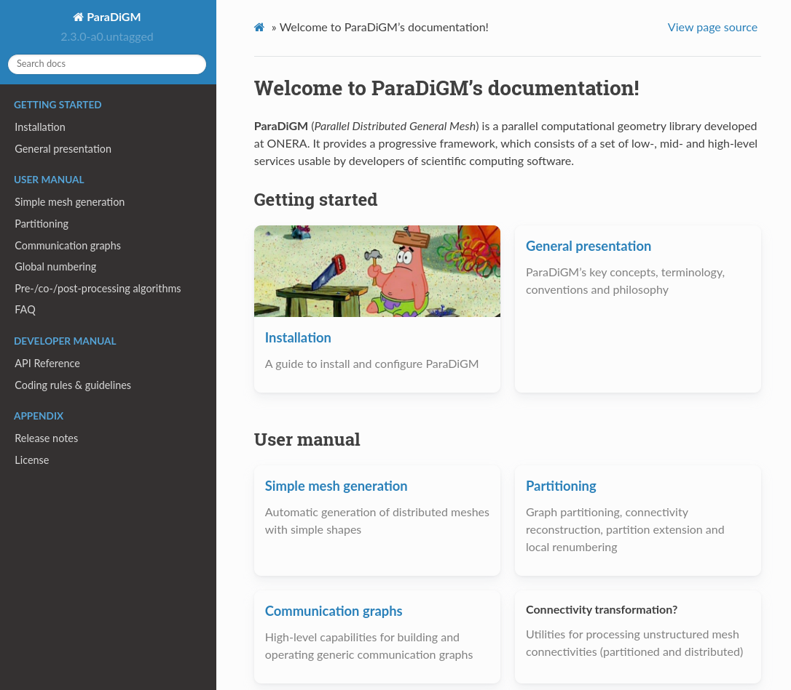
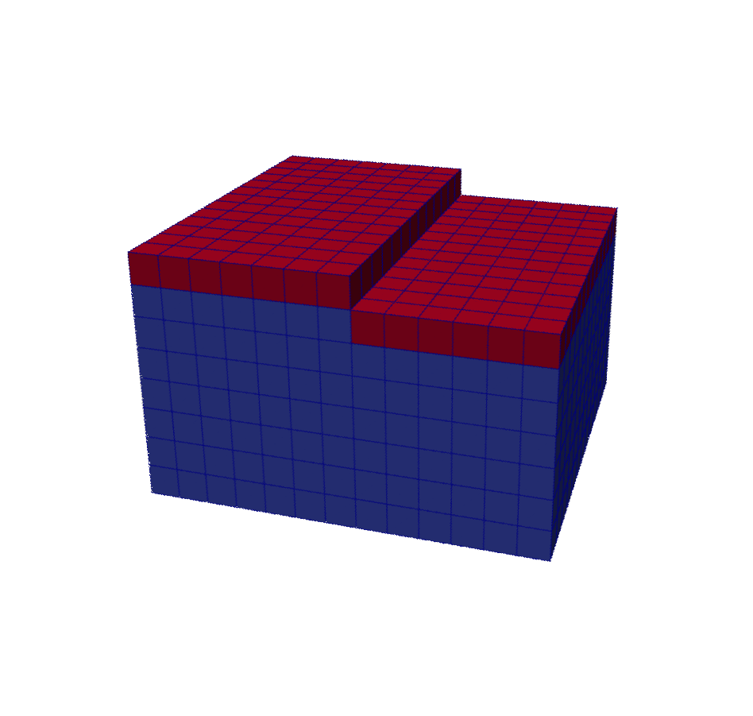

---
jupytext:
  text_representation:
    extension: '.md'
    format_name: myst
    format_version: '0.7'
    jupytext_version: 1.4.0+dev
kernelspec:
  display_name: Python 3
  language: python
  name: python3
---

# Introduction

Welcome to the **ParaDiGM** library introductory day !

The aim of the day is to give you : 
 - An overview of **ParaDiGM**'s features
 - An understanding of **ParaDiGM**'s advanced parallelism concepts
 - An understanding of how **ParaDiGM** can be called in your software written in C/C++, Fortran or Python.

This is an interactive course, so don't hesitate to interrupt us to ask your questions.

The training will take place in three stages:
- General presentation of **ParaDiGM**
- Description of the abstract concept of inter-partition communication graphs
- Focus on two functionalities through interactive exercises :
    - Exercise 1 : Mesh partitioning
    - Exercise 2 : Localization of a point cloud inside a mesh

# **ParaDiGM** highlights

## Origins of **ParaDiGM**

From 2009 to 2015, various HPC libraries dedicated to different themes were written. **ppart** for parallel graph partitioning, **pario** for parallel I/O as a wrapping to MPI-IO, **CWIPI** for HPC coupling... These libraries shared many principles and structures and were complementary. The idea of merging these libraries into a single one emerged in 2016.  **ParaDiGM** was born!

As the **CWIPI** library was already well used in the academic and industrial communities, it was retained, but its entire algorithmic core was replaced by **ParaDiGM**.

## Objectives

An efficient parallel algorithm takes much longer to write and validate than a sequential one. A simple sequential operation can become very difficult if you want to maintain good *load* and *memory* balancing during all algorithm steps.

Mettre image de la planche des fonctionnalites illustrees ....

**ParaDiGM** aims to offer a set of efficient services to simplify the writing of massively parallel distributed numerical simulation software, from reading data files to writing results. Numerical codes are generally based on a discretization of the study domain which can take the form of an unstructured mesh.
**ParaDiGM** only offers some services for unstructured meshes.???

## API

The API has been designed to be as user-friendly and intuitive as possible. All functionalities are in object form. To use a feature, the user **creates** an object and then **provides** the necessary data in the form of arrays and scalars. Once all the data has been provided, the user executes the feature **compute**. As with data, results are **retrieved** in the form of arrays or **ParaDiGM** objects. All concrete results required by the user are obtained directly by dedicated functions, without the need for abstract intermediate structures. User manipulation of abstract **ParaDiGM** objects is reduced to a strict minimum.

The native API is in C and can be used in C/C++ software.

Two other APIs are available. The first one is in Python/Numpy, automatically generated from Cython, and the second one is in Fortran using Fortran's *iso-c-binding* interfaces. These APIs are not simply direct interfaces to C functions. They have been designed to be user-friendly and intuitive in each language.
*(OK mais préciser que c'est pas encore au point, et que le retour des utilisateurs est le bienvenu pour converger vers une API optimale.)*
The Python API reinforces the notion of objects, and results are provided in the form of dictionaries. The Fortran API takes Fortran pointers as input/output and not `c_ptr` types with which Fortran developers are unfamiliar. The C API contains pointer arrays. This notion is not defined in Fortran. When giving data or retrieving results in this form, the user must use the Fortran **pdm_pointer_array** intermediate structure.

## License

**ParaDiGM** is licensed under LGPL V3.0.

## Diffusion

diffusion interne + github

## Releases

The latest stable version is 2.4.0, released on November ??, 2023.

The first stable version 1.0.0 was released on March 22, 2017.

Minor versions are released every 3 to 4 months and main versions are released every 2 to 4 years.

Backward compatibility is not guaranteed between two major versions. 

API compatibility is guaranteed between two minor versions, except for new beta functionalities. 

## Man power

- DMPE :

 

Eric Quémerais (PLM) : founder of **ParaDiGM** and **CWIPI** libraries

  

 

Bastien Andrieu (PLM)

  

 

Nicolas Dellinger (HEAT) : MoDeTheC developer

  

 

Karmijn Hoogveld (PLM)

  

 

Alain Hervault (PLM) : arrived the 6th of November to work on the mesh adaptation workflow

  

 

Robin Cazalbou (PLM) : PhD student on optimizing code coupling in a massively parallel hybrid CPU-GPU environment

  

- DAAA :

 

Bruno Maugars (CLEF) : SoNICS developer

  

 

Julien Coulet (CLEF) : MAIA developer

  

 

Clément Benazet (CLEF)

  

## **ParaDiGM**'s ecosystem at ONERA

## Organization

Work has been carried out to develop the library with a workflow that takes advantage of modern software development tools.
**ParaDiGM** is available through GitLab for ONERA developers and there is a git repository available for external users.
We work on making the library available on GitHub.
Using GitLab allows us to use GitLab CI which is a continuous method of software development. At each commit on the repository,
it checks whether the library is build and passes the test base without issues.

The recent increase in the number of developers has made it possible to devote a significant amount of time to developing documentation with Sphinx.
It is still work in progress, so we are more then open to your feedback and contribution !

## Application examples

### Geometric core for code coupling : CWIPI

TO DO

### Python/CGNS interface : MAIA

TO DO

### Use of low level features : MCC in CEDRE

TO DO

### Modernizing an existing code : MoDeTheC

TO DO

### Creating a new code : SoNICS

TO DO

### Use in legacy codes

pypart via elsA

## Installation Instructions

### Basic Installation

*(vraiment utile de détailler, autant pointer vers doc/README, non?)*

>**cmake .**

>**make**

>**make install**

### CMake general options

> **cmake . -D\<option1_name\>=\<option1_value\> ... -D\<optionn_name\>=\<optionn_value\>** with options :  

 - **CMAKE\_INSTALL\_PREFIX=\<prefix\>** : Installation directory path

 - **PDM_ENABLE_Fortran=<ON | OFF> (default : OFF)** : Enable Fortran interface

 - **PDM_ENABLE_PYTHON_BINDINGS=<ON | OFF> (default : OFF)** : Enable python interface
      
      If a simple autodetection fails, you can use these options to find Python :

        - Python_ROOT_DIR=<path> 
        - Python_LIBRARY=<path>
        - Python_INCLUDE_DIR=<path>
        - Python_EXECUTABLE=<path>
        
      Refer to FindPython in the CMake documentation for more information.
      shared libraries are necessary for python interface (CWP_ENABLE_SHARED=ON)

 - **PDM_ENABLE_SHARED=<ON | OFF> (default : ON)** : Enable shared libraries

 - **PDM_ENABLE_STATIC=<ON | OFF> (default : ON)** : Enable static libraries

 - **PDM_ENABLE_PARMETIS=<ON | OFF> (default : ON)** : Enable [ParMETIS](https://github.com/KarypisLab/ParMETIS) library (parallel graph partitioning)

      If a simple autodetection fails, you can use PARMETIS_DIR=\<path\> and METIS_DIR=\<path\> options       

      CMake looks for :

        - parmetis.h and metis.h includes
        - parmetis and metis libraries
  
      To link shared libraries, ParMETIS has to be compiled with "-fPIC" option. **ParaDiGM** is compatible with a 32-bit or 64-bit installation.

 - **PDM_ENABLE_PTSCOTCH=<ON | OFF> (default : ON)** : Enable [PTSCOTCH](https://gitlab.inria.fr/scotch/scotch) library (parallel graph partitioning) :
      If a simple autodetection fails, you can use these options to find PTSCOTCH :
        PTSCOTCH_DIR=\<path\>

     CMake looks for :

        - ptscotch.h include file
        - scotch, scotcherr, ptscotch, ptscotcherr libraries
  
     To link shared libraries, PTSCOTCH has to be compiled with "-fPIC" and SCOTCH_PTHREAD_MPI=OFF. *ParaDiGM* is compatible with a 32-bit or 64-bit installation.

 - **PDM_ENABLE_LONG_G_NUM= <ON | OFF> (default : ON)** : Enable long global numbering

        - ON : PDM_g_num_t type is "long int"
        - OFF : PDM_g_num_t type is "int"

 - **PDM_ENABLE_DOC= <ON | OFF> (default : OFF)** : Enable Documentation

     prerequis (sphinx, sphinx fortran, ...)

### CMake compiler options

> **CC=<C compiler> CXX=<CXX compiler> FC=<Fortran compiler> cmake ...**

or 

> use the following CMake options:

 - **CMAKE_C_COMPILER=\<C compiler\>**
 - **CMAKE_CXX_COMPILER=\<CXX compiler\>**
 - **CMAKE_Fortran_COMPILER=\<Fortran compiler\>**

### CMake MPI options:

 - **MPI_C_COMPILER=\<C mpi wrapper\>**
 - **MPI_CXX_COMPILER=\<CXX mpi wrapper\>**
 - **MPI_Fortran_COMPILER=\<Fortran mpi wrapper\>**

   If a simple autodetection fails, you can use these options to find MPI:

    - **MPI_\<lang\>_LIBRARIES**
    - **MPI_\<lang\>_INCLUDE_PATH**
  
   Refer to FindMPI in the CMake documentation for more informations.

## Concepts and definition

### Mesh

Most computational methods rely on a mesh for the spatial discretization of partial differential equations.
A mesh is composed of entities of different dimensions. The following terminology is used in **ParaDiGM** :
- **cells**: 3D entities such as tetrahedra, pyramids, prisms, hexahedra or arbitrary polyhedra ;
- **faces**: 2D entities such as triangles, quadrangles or arbitrary (simply connected) polygons ;
- **edges**: 1D entities (segment between two points) ;
- **vertices** (*shortened as "**vtx**"*): points defined by their Cartesian coordinates $(x, y, z)$.

A mesh can either be *structured* or *unstructured*.

| Structured mesh | Unstructured mesh |
|:---------------:|:-----------------:|
|||

Structured meshes are typically made of blocks, each one arranged in a regular grid.
Adjacency relations between the mesh entities are therefore implicit : cell $C_{i,j,k}$ is adjacent to cells $C_{i-1,j,k}$, $C_{i+1,j,k}$, $C_{i,j-1,k}$, and so on...

Unstructured meshes, however, require an explicit description of the connectivity between mesh entities.

**ParaDiGM** deals essentially with *unstructured* meshes.

The entities and connectivities of interest depend on the numerical method.
For example, Finite Element methods typically only require the cell$\to$vertex connectivity (and face$\to$vtx for boundary faces).
On the other hand, cell-centered Finite Volume methods generally require the cell$\to$face and face$\to$vtx connectivities.
Other method, such as node-centered Finite Volume methods may also require the connectivities relative to the edges.

In **ParaDiGM** all connectivities are stored as *1-based*, possibly signed, *flat* arrays.
Because each entity $A$ may be connected to a variable number of entities $B$, an **index** is necessary to access the array $\texttt{connect}$ representing the connectivity $A \to B$.
This index is an array $\texttt{connect\_idx}$ of length $n_A + 1$ which contains the ranges, i.e. the entities $B$ connected to $A_i$ are given by $ \texttt{connect}[j]$, for $j \in \left[ \texttt{connect\_idx}[i], \texttt{connect\_idx}[i+1] \right)$.
The first element in the index array is always zero, and the last element is the length of the connectivity array.

*Note that edges can only have two endpoints, so the index for the edge$\to$vtx is useless.*

##### **Note to Fortran users**
*
Because arrays are usually indexed starting from one, you should instead read :
the entities $B$ connected to $A_i$ are given by $ \texttt{connect}[j]$, for $j \in \left( \texttt{connect\_idx}[i], \texttt{connect\_idx}[i+1] \right]$.
*

Let's take a look at a simple example to illustrate the notion we just introduced:

Here we have a simple mesh composed of 3 faces and 9 vertices.
Let's see if you can guess what the face$\to$vtx connectivity and index arrays look like...

+++ {"jupyter": {"source_hidden": true}}
Solution:
The face$\to$vtx connectivity and its index are
\begin{flalign}
  \texttt{face\_vtx\_idx} & =  [0, 4, 12, 15]&&\\\nonumber
  \texttt{face\_vtx}      & =  [{\color{red}2, 3, 6, 5}, {\color{green}1, 2, 5, 6, 3, 4, 8, 7}, {\color{blue}7, 8, 9}]&&
\end{flalign}

<!-- <code>
  face_vtx_idx = [0, 4, 12, 15]
  face_vtx     = [2, 3, 6, 5, 1, 2, 5, 6, 3, 4, 8, 7, 7, 8, 9]
</code> -->

<!-- $$face_vtx = [\underbrace{2, 3, 6, 5}_{face 1}, \quad \underbrace{1, 2, 5, 6, 3, 4, 8, 7}_{face 2}, \quad \underbrace{7, 8, 9}_{face 3} ]$$
 -->

+++

Vertices are described by the $3 \cdot n_\mathrm{vtx}$ *flat* array of the Cartesian coordinates. The coordinates are stored in an *interlaced* fashion:
$\left(x_0, y_0, z_0, x_1, y_1, z_1, \ldots \right)$.

*Note that in **ParaDiGM** coordinates are always assumed to be three-dimensional, even for 2D, planar meshes.*

##### **Note to Fortran users**
*
Coordinates are stored as rank-2 arrays with shape $[3, n_\mathrm{vtx}]$.
*

#### Additional

**ParaDiGM** features more advanced mesh-related notions.
Most notably, some mesh entities can be organized into **groups**, that come handy for instance to represent the different boundary conditions.
Also, is worth mentioning that **ParaDiGM** supports high-order, curved meshes.
These more advanced notions go beyond the scope of this training so we will not focus on them today.

### Parallel reading of meshes

*How do you read a mesh in parallel?*

In this section we will answer this question through an interactive game.
We placed tokens face down on the table at the front of the room. Some of you have a number on your table.
This number symbolizes the number of the MPI rank you will be playing.
In ascending order, a representative of each rank will collect an equitably distributed number of chips.

*How many tokens will each MPI rank get for the reading workload to be balanced?*

Once, that question is answered, each one of you take the amount of tokens your MPI ranks is supposed to get.
By doing this, you have as a group done a parallel read of a mesh.
The mesh data distribution you created is what we call *block-distributed*.
This distribution of data ensures the uniqueness of each entity across the processors.
That turns out to be handy for parallel data sorting, a core tool for parallel algorithms.

The data distribution of your mesh entities is not such that entities close geometrically are on the same processor.

*How are we supposed to work with this block-distributed mesh?*

### Mesh partitioning

For you to be able to work with the mesh we just read, it has to be partitioned.
That means that the mesh elements will be distributed over the processors such that elements that are close geometrically will end up on the same processor.
This is what you will do in Exercise 1 of this training.

*I need on each processor, the coordinates of the vertices of my elements. What do I do?*

During the mesh reading step, the vertices are read per block as you have done for the mesh elements.
This means that a vertex on a given rank usually is not associated to any of the elements on that rank.
There is a element->vertex connectivity to know which vertices are associated to each element.

*How do you know where the coordinates for the vertices of your elements are?*

### Global IDs

Each entity in the mesh has a unique identifier. Let go back to the example of the house studied earlier.

<!-- <code>
  face_vtx_idx = [0, 4, 12, 15]
  face_vtx     = [2, 3, 6, 5, 1, 2, 5, 6, 3, 4, 8, 7, 7, 8, 9]
</code> -->

The first face has 4 vertices : the second, the third, the 6th and the 5th on the current MPI rank.
The following array shows the global IDs of the vertices on the current MPI rank.

<!-- <code>
  vtx_global_ids = [12, 11, 3, 9, 2, 8, 4, 13, 10]
</code> -->

*What are the global numbers of the vertices of the first face?*

They are 2->11, 3->3, 6->8 and 5->2. Now that we know their global ID, we can ask the rank that read that ID to provide coordinates associated to that vertex.

Now you should proceed in the same way with the tokens on your desk.

*What is the global number associated to the local number of the vertices for each element on my tokens?*

To do that, use the vertex global numbering array on the paper.

Have a look at the vertex coordinates the others got. You will see that some of them have the same as you do.
This is a key difference with the block-distributed vision we saw earlier. We know work with a so called partitioned vision.

*Remark : We never asked you to discard the tokens of the block-distributed vision. This is because they will coexist in memory.*

### Parallel distribué MPI

TO DO: Reprendre prez Julien

ex : génération de gnum (pas un exercice mais montrer du code) -> exposer graph de communication

## Features overview

### MPI communication wrapper tools

##### **Note**
*
Advanced feature. Used in ParaDiGM algorithm development.
*

As you have seen with the game earlier, the block-distributed and partitioned point of view are key in parallel load balanced algorithms.
That for it is paramount to be able to easily switch between those two.
`PDM_part_to_block` and `PDM_block_to_part` are low level tools to wrap the creation of MPI communication graphs.

It arised that we needed a function to link partitions in order to exchange fields.
This particularly is at stake at the end ParaDiGM algorithms to make a link between the partitionned input mesh data and the partitionned output mesh data.
This is the `PDM_part_to_part` function. You will use it at the end of the day in the last exercise.

### Parallel I/O

When we talked about the reason to be of **ParaDiGM** earlier, we talked about **pario** for parallel I/O as a wrapping to MPI-IO.
Naturally, this feature is retained in the code. The parallel mesh writer in **ParaDiGM** is available for the Ensight format.
It is used to write the mesh interfaces during coupling in CWIPI as well as writing output meshes in CEDRE.

### Partitioning

#### Mesh partitioning

 

- What ? Mesh partitioning
- What for ? To partition an input mesh which has been read in parallel for instance

  

This feature will be explored in the first exercise of this training.

#### Mesh partition extraction

 

- What ? Extract and partition an area of a mesh
- What for ? To run an algorithm only on a sub-mesh or for post-processing an area of interest

  

#### Mesh partition extension

##### **Note**
*
Beta-feature. Still underconstruction. API might change.
*

 

- What ? To provide a topologically consistent mesh partition over an extended neighbourhood
- What for ? Allows to parallelize numerical methods that would initially be complex parallelize (WENO/ENO, multislope, v4)

  

This feature is given as a bonus of the first exercise of this training.

### Pre-, Co- and Post- processing

#### Mesh location

 

- What ? Check if the points of a point cloud are inside or outside of a given closed surface
- What for ? Spatial interpolation, coupling

  

You will explore this feature in the last exercise of this training.

#### Closest points

 

- What ? Check if the points of a point cloud are inside or outside of a given closed surface
- What for ? Spatial interpolation, coupling

  

#### Mesh intersection & overlay

 

- What ? Intersection between two meshes and reconstruction of the intersected mesh (only available in 2D)
- What for ? Spatial interpolation, coupling

  

#### Ray tracing

 

- What ? Check if the points of a point cloud are inside or outside of a given closed surface
- What for ? For chimera methods, IBC ...

  

#### Distance to surface

 

- What ? Compute the distance of points to a surface
- What for ? Allows level-setting, computation of wall distances for turbulence models

  

#### Iso-surfaces & slices

##### **Note**
*
Beta-feature. Still underconstruction. API might change.
*

 

- What ? Get the slice of a mesh on iso-lines of the field
- What for ? Post-processing a numerical simulation

  

#### Mesh adaptation/remeshing

##### **Note**
*
Beta-feature. Still underconstruction. API might change.
*

 

- What ? Parallel mesh adaptation algorithm
- What for ? To use mesh adaptation in a fully parallel workflow

  

# Exercise 0

You can now move on to [Exercise 0](./exercice_0.ipynb).
