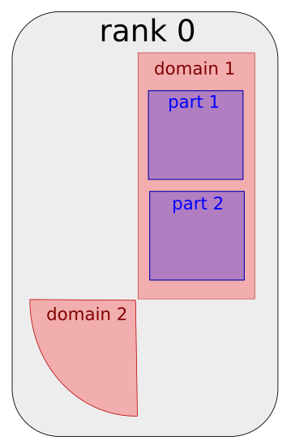

---
jupytext:
  text_representation:
    extension: '.md'
    format_name: myst
    format_version: '0.7'
    jupytext_version: 1.4.0+dev
kernelspec:
  display_name: Python 3
  language: python
  name: python3
---

# Exercise 1 : Mesh partitioning

It's time for some hands on experience with `ParaDiGM`!
Using the API referenced [here](https://numerics.gitlab-pages.onera.net/mesh/paradigm/dev_doc_pretty/user_manual/prepro_algo/index.html#python-api),
you will have to fill in the code cells to partition a mesh, i.e. to cut it in subdomains that will be mapped onto the processors of a parallel machine.
In the first section, we generate a block-distributed cube mesh for you. In the next section, you'll start running the partitioning algorithm.
After that, you will be able to retrieve the arrays describing the partitionned mesh.

+++

*(Load custom magics)*

```{code-cell}
import os, sys
module_path = os.path.abspath(os.path.join('../../utils'))
if module_path not in sys.path:
    sys.path.append(module_path)
```

```{code-cell}
%reload_ext visu_magics
%reload_ext code_magics
```

+++


## Generate the mesh

In this section, `ParaDiGM` tools are used to generate a simple mesh for this exercise: a cube made of tetrahedra.

```{code-cell}
%%code_block -p exercise_1 -i 1
#!/usr/bin/env python

import numpy as np
import mpi4py.MPI as MPI
import Pypdm.Pypdm as PDM

 # Initialize MPI environment
comm   = MPI.COMM_WORLD
n_rank = MPI.COMM_WORLD.size
i_rank = MPI.COMM_WORLD.rank

# Generate block-distributed cube mesh
n_x      = 10
n_y      = 10
n_z      = 10
lengthx  = 1.
xmin     = 0.
ymin     = 0.
zmin     = 0.
elt_type = PDM._PDM_MESH_NODAL_TETRA4
order    = 1
dcube = PDM.DCubeNodalGenerator(n_x,
                                n_y,
                                n_z,
                                lengthx,
                                xmin,
                                ymin,
                                zmin,
                                elt_type,
                                order,
                                comm)

dcube.compute()

dmn = dcube.get_dmesh_nodal()

PDM.generate_distribution(dmn)
```

Now that we have our mesh, let's partition it !

## Mesh partitioning

For mesh partitioning, as for all other `ParaDiGM` features, there are 5 main steps:
1. **create** the feature object
2. **set** the data necessary to operate with that feature
3. **compute**, operate the algorithm of the feature
4. **get**, retrieve the ouput of the algorithm
5. **free** the memory allocated to operate the feature

Following this logic, let's start **creating** (step 1) the mesh partitioning object for homogeneously balanced subdomains.

*Remark : since this is a basic example, we ask you to stick with the fixed values for n_zone, n_part, i_zone, i_part and merge_zones.
To get insight about the concepts behind those values you can have a look [here](#Annex-1)*

```{code-cell}
%%code_block -p exercise_1 -i 2

# Create partitioning object
n_zone = 1      # fixed
n_part = 1      # fixed
i_zone = 0      # fixed
i_part = 0      # fixed
merge_zones = 0 # fixed
part_method = PDM._PDM_SPLIT_DUAL_WITH_HILBERT;
mpart = PDM.MultiPart(n_zone,                             # Number of zones
                      np.array([n_part]).astype(np.intc), # Number of partitions per zone
                      merge_zones,                        # PDM_FALSE (do not fuse zones)
                      part_method,                        # Partitioning method
                      1,                                  # PDM_PART_SIZE_HOMOGENEOUS (subdomains are homogeneously balanced)
                      None,                               # Weight (in %) of each partition in heterogeneous case
                      comm)                               # MPI communicator

```

Here, we chose to partition the cube with the Hilbert method. This method implemented in `ParaDiGM` does not ensure the subdomain to be connected.
This method is favored within the `ParaDiGM` algorithms since it provides quickly a good load balance. To ensure the partitions are connected use
`PDM_SPLIT_DUAL_WITH_PARMETIS` or `PDM_SPLIT_DUAL_WITH_PTSCOTCH` which call the external libraries ParMETIS and PT-Scotch.

After mapping the partitionned subdomains on the processors, it is interesting to renumber the entities
of the mesh on each processor for performance through cache blocking but it also provides interesting properties for the application.
You can here call the renumbering function but by telling it not to do any renumbering for a start.

```{code-cell}
%%code_block -p exercise_1 -i 3

renum_cell = bytes("PDM_PART_RENUM_CELL_NONE", 'ascii')
renum_face = bytes("PDM_PART_RENUM_FACE_NONE", 'ascii')
mpart.multipart_set_reordering(-1,         # All zones
                               renum_cell,
                               renum_face,
                               None)

```

Now that you have created a mesh partitioning object `mpart`, you can **set** (step 2) the cube mesh to it.

```{code-cell}
%%code_block -p exercise_1 -i 4

mpart.multipart_register_dmesh_nodal(i_zone, dmn)
```

At this point you have provided all the information necessary to run the mesh partitioning algorithm. You can call the function to
**compute** (step 3) the subdomains that make up the partitionned cube.

```{code-cell}
%%code_block -p exercise_1 -i 5

mpart.multipart_run_ppart()
```

## Get the partitionned mesh

You can now **get** (step 4) the ouput mesh of the partitioning algorithm. Depending on the numerical method, the mesh has to be
described in a different way. For Finite-Element methods a nodal connectivity ([option 1](#Nodal-connectivity-(i.e.-Finite-Element-style)))) usually
suffices while for Finite-Volume methods all descending connectivities ([option 2](#Descending-connectivity-(i.e.-Finite-Volume-style))) are of interest.
Choose which one suits you best and go further in the exercise to the associated section.

### Nodal connectivity (i.e. Finite-Element style)

You choose to get the partitioned mesh in nodal connectivity, i.e. cell->vertex connectivity.

*Remark : The object in `ParaDiGM` in which partitionned nodal meshes are stored is `part_mesh_nodal`.
Here we get this object from `mpart` to directly have access to the arrays we are interested in.*

Let's start with the vertices composing the subdomain. How many vertices are there? What is their global number? What are their coordiantes?

```{code-cell}
%%code_block -p exercise_1 -i 6

# output = mpart.multipart_vtx_coord_get(i_part,
#                                        i_zone)
# coords = output["np_vtx_coord"]
#
# pmn = mpart.multipart_part_mesh_nodal_get(i_zone)
# vtx_ln_to_gn = PDM.part_mesh_nodal_vtx_g_num_get(pmn, i_part)
# n_vtx        = len(vtx_ln_to_gn)

```

Let's move on to the cells. How are the vertices connected to form cells? What is their global number? How many cells are there?

*Remark : since this is a basic example, we ask you to stick with the fixed value for i_section.
To get insight about the concept behind this value you can have a look [here](#Annex-1)*

```{code-cell}
%%code_block -p exercise_1 -i 7

# i_section = 0 # fixed
# output = PDM.part_mesh_nodal_get_sections(pmn,
#                                           PDM._PDM_GEOMETRY_KIND_VOLUMIC,
#                                           i_part)
# elt_vtx      = output[i_section]["np_connec"]
# elt_ln_to_gn = output[i_section]["np_numabs"]
# n_elt        = len(elt_ln_to_gn)

```
Now we write the mesh that we just got to be able to visualize it later on (nothing to do).

```{code-cell}
%%code_block -p exercise_1 -i 8

# PDM.writer_wrapper(comm,
#                    "visu",
#                    "pmesh",
#                    [coords],
#                    [vtx_ln_to_gn],
#                    [None],
#                    [elt_vtx],
#                    [elt_ln_to_gn],
#                    PDM._PDM_WRITER_TETRA4)

```

### Descending connectivity (i.e. Finite-Volume style)

You choose to get the partitioned mesh in descending connectivity, i.e. cell->face, face->edge and edge->vtx connectivities.

Let's start from the top with cell data. How many cells are there? What is their global number? Which faces compose the cells?

```{code-cell}
%%code_block -p exercise_1 -i 9

output = mpart.multipart_ln_to_gn_get(i_part,
                                      i_zone,
                                      PDM._PDM_MESH_ENTITY_CELL)

cell_ln_to_gn = output["np_entity_ln_to_gn"]
n_cell = len(cell_ln_to_gn)

output = mpart.multipart_connectivity_get(i_part,
                                          i_zone,
                                          PDM._PDM_CONNECTIVITY_TYPE_CELL_FACE)

cell_face_idx = output["np_entity1_entity2_idx"]
cell_face     = output["np_entity1_entity2"]

```

For the faces we proceed in a similar way. How many faces are there? What is their global number? Which edges compose the faces?

```{code-cell}
%%code_block -p exercise_1 -i 10

output = mpart.multipart_ln_to_gn_get(i_part,
                                      i_zone,
                                      PDM._PDM_MESH_ENTITY_FACE)

face_ln_to_gn = output["np_entity_ln_to_gn"]
n_face = len(face_ln_to_gn)

output = mpart.multipart_connectivity_get(i_part,
                                          i_zone,
                                          PDM._PDM_CONNECTIVITY_TYPE_FACE_EDGE)

face_edge_idx = output["np_entity1_entity2_idx"]
face_edge     = output["np_entity1_entity2"]

```

Let's do the same for edges. How many edges are there? What is their global number? Which vertices compose the edges?

*Remark : The edge->vertex connectivity index is not created in the `mpart` object since it is implicit. Indeed,
each edge is only composed of two vertices*

```{code-cell}
%%code_block -p exercise_1 -i 11

output = mpart.multipart_ln_to_gn_get(i_part,
                                      i_zone,
                                      PDM._PDM_MESH_ENTITY_EDGE)

edge_ln_to_gn = output["np_entity_ln_to_gn"]
n_edge = len(edge_ln_to_gn)

output = mpart.multipart_connectivity_get(i_part,
                                          i_zone,
                                          PDM._PDM_CONNECTIVITY_TYPE_EDGE_VTX)

edge_vtx = output["np_entity1_entity2"]

```

To finish with, we need to have the description of the vertices.

```{code-cell}
%%code_block -p exercise_1 -i 12

output = mpart.multipart_ln_to_gn_get(i_part,
                                      i_zone,
                                      PDM._PDM_MESH_ENTITY_VERTEX)

vtx_ln_to_gn = output["np_entity_ln_to_gn"]
n_vtx = len(vtx_ln_to_gn)

output = mpart.multipart_vtx_coord_get(i_part,
                                       i_zone)

coords = output["np_vtx_coord"]

```

Now we write the mesh that we just got to be able to visualize it later on (nothing to do).

```{code-cell}
%%code_block -p exercise_1 -i 13

face_vtx = PDM.compute_face_vtx_from_face_and_edge(face_edge_idx,
                                                   face_edge,
                                                   edge_vtx)
face_vtx_idx = np.array([3*i for i in range(n_face+1)]).astype(np.intc)

PDM.writer_wrapper(comm,
                   "visu",
                   "pmesh",
                   [coords],
                   [vtx_ln_to_gn],
                   [face_vtx_idx],
                   [face_vtx],
                   [cell_ln_to_gn],
                   -1,
                   [cell_face_idx],
                   [cell_face])

```

## Bonus : Extended partition

If you are reading this, you finished quickly the partitioning exercise. Thus, it means you understood well the 5 step scheme for using `ParaDiGM` features.

*Remark : To do this bonus you need to have retrieved the mesh in descending connectivity. If you haven't done that yet, please comment your
work on nodal connectivities and get the mesh in descending connectivity first.*

In this bonus, we want to get one layer of extended cells by nodes for our mesh partitions.

### Step 1

```{code-cell}
%%code_block -p exercise_1 -i 14

extend_type = PDM._PDM_EXTEND_FROM_VTX
depth       = 1
part_ext = PDM.PartExtension(n_zone,
                             np.array([n_part]).astype(np.intc),
                             extend_type,
                             depth,
                             comm)
```

### Step 2

```{code-cell}
%%code_block -p exercise_1 -i 15

output = mpart.multipart_graph_comm_get(i_part,
                                        i_zone,
                                        PDM._PDM_BOUND_TYPE_VTX)

vtx_part_bound_proc_idx = output["np_entity_part_bound_proc_idx"]
vtx_part_bound_part_idx = output["np_entity_part_bound_part_idx"]
vtx_part_bound          = output["np_entity_part_bound"]

part_ext.set_part(i_zone,
                  i_part,
                  n_cell,
                  n_face,
                  0, # n_face_part_bound
                  0, # n_face_group
                  n_edge,
                  n_vtx,
                  cell_face_idx,
                  cell_face,
                  None, # face_cell
                  face_edge_idx,
                  face_edge,
                  None, # face_vtx_idx
                  None, # face_vtx
                  edge_vtx,
                  None, # face_group_idx
                  None, # face_group
                  None, # face_join_idx
                  None, # face_join
                  None, # face_part_bound_proc_idx
                  None, # face_part_bound_part_idx
                  None, # face_part_bound
                  vtx_part_bound_proc_idx,
                  vtx_part_bound_part_idx,
                  vtx_part_bound,
                  cell_ln_to_gn,
                  face_ln_to_gn,
                  edge_ln_to_gn,
                  vtx_ln_to_gn,
                  None, # face_group_ln_to_gn
                  coords)
```

### Step 3

```{code-cell}
%%code_block -p exercise_1 -i 16

part_ext.compute()
```

### Step 4

```{code-cell}
%%code_block -p exercise_1 -i 17

# Cell
cell_ext_ln_to_gn = part_ext.get_ln_to_gn(i_zone,
                                          i_part,
                                          PDM._PDM_MESH_ENTITY_CELL)

cell_face_ext, cell_face_ext_idx = part_ext.get_connectivity(i_zone,
                                                             i_part,
                                                             PDM._PDM_CONNECTIVITY_TYPE_CELL_FACE)

# Face
face_ext_ln_to_gn = part_ext.get_ln_to_gn(i_zone,
                                          i_part,
                                          PDM._PDM_MESH_ENTITY_FACE)

face_edge_ext, face_edge_ext_idx = part_ext.get_connectivity(i_zone,
                                                             i_part,
                                                             PDM._PDM_CONNECTIVITY_TYPE_FACE_EDGE)

# Edge
edge_ext_ln_to_gn = part_ext.get_ln_to_gn(i_zone,
                                          i_part,
                                          PDM._PDM_MESH_ENTITY_EDGE)

edge_vtx_ext, edge_vtx_ext_idx = part_ext.get_connectivity(i_zone,
                                                           i_part,
                                                           PDM._PDM_CONNECTIVITY_TYPE_EDGE_VTX)

# Vertices
vtx_ext_ln_to_gn = part_ext.get_ln_to_gn(i_zone,
                                         i_part,
                                         PDM._PDM_MESH_ENTITY_VERTEX)

vtx_coord_ext = part_ext.get_coord(i_zone,
                                   i_part)
```

```{code-cell}
%%code_block -p exercise_1 -i 18

n_cell_ext = len(cell_ext_ln_to_gn)
n_face_ext = len(face_ext_ln_to_gn)
n_edge_ext = len(edge_ext_ln_to_gn)
n_vtx_ext  = len(vtx_ext_ln_to_gn)

total_n_cell = n_cell + n_cell_ext
total_n_face = n_face + n_face_ext
total_n_edge = n_edge + n_edge_ext
total_n_vtx  = n_vtx  + n_vtx_ext

# Cell
total_cell_ln_to_gn = np.concatenate((cell_ln_to_gn, cell_ext_ln_to_gn), axis=0, dtype=PDM.npy_pdm_gnum_dtype)

total_cell_face_idx = np.zeros(total_n_cell + 1, dtype=np.intc)
for i in range(n_cell + 1):
  total_cell_face_idx[i] = cell_face_idx[i]
for i in range(n_cell_ext + 1):
  total_cell_face_idx[n_cell + i] = cell_face_idx[n_cell] + cell_face_ext_idx[i]

total_cell_face = np.concatenate((cell_face, cell_face_ext), axis=0, dtype=np.intc)

# Face
total_face_ln_to_gn = np.concatenate((face_ln_to_gn, face_ext_ln_to_gn), axis=0, dtype=PDM.npy_pdm_gnum_dtype)

total_face_edge_idx = np.zeros(total_n_face + 1, dtype=np.intc)
for i in range(n_face + 1):
  total_face_edge_idx[i] = face_edge_idx[i]
for i in range(n_face_ext + 1):
  total_face_edge_idx[n_face + i] = face_edge_idx[n_face] + face_edge_ext_idx[i]

total_face_edge = np.concatenate((face_edge, face_edge_ext), axis=0, dtype=np.intc)

# Edge

total_edge_ln_to_gn = np.concatenate((edge_ln_to_gn, edge_ext_ln_to_gn), axis=0, dtype=PDM.npy_pdm_gnum_dtype)

total_edge_vtx = np.concatenate((edge_vtx, edge_vtx_ext), axis=0, dtype=np.intc)

# Vertices

total_vtx_ln_to_gn = np.concatenate((vtx_ln_to_gn, vtx_ext_ln_to_gn), axis=0, dtype=PDM.npy_pdm_gnum_dtype)

total_coords = np.concatenate((coords, vtx_coord_ext), axis=0, dtype=np.double)

# face->vtx

total_face_vtx = PDM.compute_face_vtx_from_face_and_edge(total_face_edge_idx,
                                                         total_face_edge,
                                                         total_edge_vtx)
total_face_vtx_idx = np.array([3*i for i in range(total_n_face+1)]).astype(np.intc)

PDM.writer_wrapper(comm,
                  "visu",
                  "pext",
                   [total_coords],
                   [total_vtx_ln_to_gn],
                   [total_face_vtx_idx],
                   [total_face_vtx],
                   [total_cell_ln_to_gn],
                   -1, # cell_t
                   [total_cell_face_idx],
                   [total_cell_face])
```

### Step 5

Well, you have nothing to do for step 5 since it is implicit in Python.

## Execution and visualization

Run the following cells to execute to program you just wrote and visualize the partitionned output mesh.

```{code-cell}
%merge_code_blocks -l python -p exercise_1 -n 2 -v -c
```

```{code-cell}
%%visualize
visu/PMESH.case : i_part
visu/PEXT.case : i_part
```
## Annex 1

In certain settings, the mesh is an assembly of several sub-meshes. These are called *zones*.


Each zone *zone* is partitionned in subdomains which
are mapped to the processors of the parallel machine. On a processor the subdomain (of a mesh or a zone) can be sudivided in *parts*.



A mesh can be composed of several element types (tetrahedra, hexahedra, prisms...). In certain settings, the mesh definition for each specific element type
is stored in a seperate *section*. So in a *section* one will find data for a specific element type.


